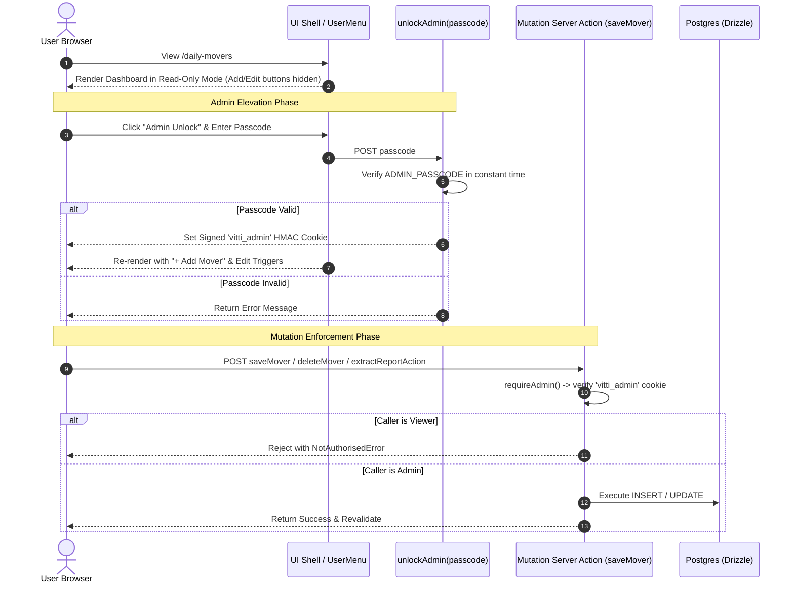
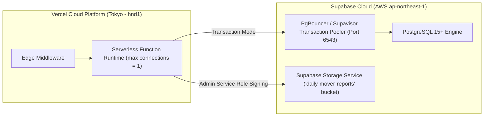

# High-Level Design (HLD) — Daily Movers Dashboard

## 1. Executive Summary & Purpose

The **Daily Movers Dashboard** is an internal research knowledge management platform built for **Vitti Capital**. Its primary objective is to serve as a searchable, structured, and permanent archive of Daily Mover equity research reports on ASX-listed companies.

When investment analysts and portfolio managers review a company that experiences significant price movements, they can immediately retrieve historical research, previous catalyst analyses, and past investment takeaways to understand: *"What did we say last time?"*

---

## 2. Business Context & Problem Statement

### 2.1 The Problem
Historically, equity research reports and daily mover summaries were stored in unstructured formats (PDF files, email threads, chat channels). This caused:
- **Information Fragmentation**: Difficulty searching past commentary across different reporting periods.
- **Entity Disconnect**: Variations in ticker naming (e.g., `JBH` vs `JBH.AX`) splitting research history.
- **Inconsistent Categorisation**: Unstandardized catalyst classification (e.g., "Earnings Result" vs "FY26 Results").
- **Loss of Nuance**: Discrepancies between headline percentage moves, intraday peaks, and final closing figures.
- **File Distribution Risk**: Unrestricted public URLs or large attachments failing serverless payload limits.

### 2.2 The Solution
A unified, web-based intelligence archive featuring:
1. **Normalized Relational Data Model**: Strict entity binding via foreign keys to unique company records.
2. **Standardized Lookups**: Controlled vocabularies for catalysts and analysts.
3. **Derived Metrics**: Deterministic derivation of price movement direction from signed percentage values.
4. **URL-Synchronized Server-Side Filtering**: Performant, deep-linkable search, catalyst filtering, date-range filtering, and pagination handled entirely at the database layer.
5. **Direct-to-Storage PDF Management**: Direct browser-to-storage signed uploads bypassing serverless payload limits, coupled with short-lived (60s) signed download URLs.
6. **Role-Gated Research Operations**: Distinction between research consumers (Viewers) and research authors (Admins).
7. **Institutional Terminal Aesthetics**: Purpose-built financial UI featuring Light / Midnight Navy Dark theme toggle, Plus Jakarta Sans & JetBrains Mono typography, and high-density directional metrics.

---

## 3. High-Level System Architecture

The application adopts a **Modern Server-First Architecture** utilizing Next.js App Router, React Server Components (RSC), Drizzle ORM, Supabase Postgres, and Supabase Private Storage.

```mermaid
graph TD
    subgraph Client["Client Tier (Browser)"]
        UI["Web UI (React 19 / Tailwind 4 / shadcn / next-themes)"]
        Cookie["Session Cookie (vitti_admin HMAC-SHA256)"]
        Theme["Theme State (Light / Midnight Dark / System)"]
        Uploader["Direct S3-Compatible Upload Client"]
        ZipBtn["DownloadReportsButton (Admin-Only ZIP Exporter)"]
    end

    subgraph Edge["Edge Infrastructure"]
        MW["Next.js Edge Middleware / Layout Auth Checks"]
    end

    subgraph Server["Application Server Tier (Next.js App Router / Vercel Serverless)"]
        RSC["React Server Components (Layouts, Pages)"]
        SA["Server Actions (saveMover, deleteMover, createReportUploadUrl, extractReportAction)"]
        PDFRoute["Protected PDF Route (/api/reports/[id])"]
        ZipRoute["Protected Batch ZIP Route (/api/reports/download-all)"]
        PriceRoute["Price Refresh Route (/api/prices/refresh)"]
        CronRoute["Scheduled Draft Route (/api/cron/daily-mover)"]
        DraftPdfRoute["Admin-Only Draft PDF Route (/api/drafts/[id]/pdf)"]
        DraftPipeline["Mover Studio Pipeline (screen -> select -> read -> write -> render)"]
        PostPipeline["Post Studio Assessor (judge the call -> draft copy only if validated)"]
        LogoRoute["Logo Proxy Route (/api/logo/[ticker])"]
        AuthLayer["Auth & Session Verification (Web Crypto HMAC)"]
        QueryLayer["Data Access Layer (lib/queries.ts - server-only)"]
    end

    subgraph External["External Data Providers"]
        Yahoo["Yahoo Finance API (ASX Quotes, Chart Closes, Corporate Profiles)"]
        LogoCDN["Logo Sources (Parqet CDN + Official Domain Scraper + Favicons)"]
    end

    subgraph Database["Data Tier (Supabase / AWS Tokyo)"]
        Pooler["Supabase Transaction Pooler (Port 6543)"]
        Postgres["PostgreSQL Database (RLS Enforced, Zero Public Policies)"]
        Storage["Private Storage Bucket ('daily-mover-reports' - 25MB limit)"]
    end

    UI -->|HTTP Requests| MW
    MW -->|Authorized Session| RSC
    RSC --> QueryLayer
    SA --> AuthLayer
    SA --> QueryLayer
    QueryLayer -->|postgres.js driver| Pooler
    Pooler --> Postgres

    %% Upload and Download flows
    UI -->|1. Request Upload Ticket| SA
    SA -->|Generate Signed Upload URL| Storage
    Uploader -->|2. Direct PUT PDF| Storage
    UI -->|3. Request Document| PDFRoute
    PDFRoute -->|Verify Session & Mint Signed URL| Storage

    %% Batch ZIP Download flow
    ZipBtn -->|Admin GET /api/reports/download-all| ZipRoute
    ZipRoute -->|Verify canWrite & Pool Downloads| Storage
    ZipRoute -->|Stream in-memory JSZip archive| ZipBtn

    %% Automatic price refresh (pull-based, no cron)
    UI -->|After paint: POST refresh| PriceRoute
    PriceRoute -->|Only if stale| Yahoo
    PriceRoute -->|Upsert closes & quote| QueryLayer
    UI -->|Logo per ticker| LogoRoute
    LogoRoute -->|1. Parqet / 2. Yahoo Profile Website / 3. Scraped HTML Favicons| LogoCDN
```

---

## 4. Technology Stack & Component Justifications

| Tier / Function | Technology | Justification & Architectural Role |
| :--- | :--- | :--- |
| **Application Framework** | **Next.js 16 (App Router)** | Hybrid SSR/RSC rendering model, zero-client-bundle data fetching, native streaming, Server Actions for mutations. |
| **Language** | **TypeScript 5** | Strict end-to-end type safety spanning database schemas, Zod validation schemas, and UI components. |
| **Styling & Design System** | **Tailwind CSS 4 + shadcn/ui** | Design-token-driven styling, accessible Base UI/Radix primitives, Lucide React icons. |
| **Theming System** | **next-themes** | Client-side Light / Midnight Navy Dark / System theme switching with hydration safety and local storage persistence. |
| **Typography** | **Plus Jakarta Sans + JetBrains Mono** | High-legibility geometric UI typography paired with developer/financial-grade monospace figures for tickers and percentage metrics. |
| **AI Extraction Engine** | **Anthropic Claude Sonnet 4.6** | Native multimodal document parser extracting structured equity research metadata from raw PDF bytes. Text is extracted locally first and the PDF is only sent as a document block when that fails. |
| **AI Drafting & Verification Engine** | **Anthropic Claude Opus 5** | Selects the day's subject, writes the report as typed page blocks, and then re-reads it against the same filings as the Accuracy Gate. The tier is chosen for reasoning over a large evidence corpus: the failures that matter are a figure that felt correct and conditional money written as certain. |
| **Market Data & Discovery** | **`yahoo-finance2`** | Maintained client for Yahoo Finance: owns cookie/crumb handshake and rate-limiting. Used for batch quote refreshes, daily closes backfilling, per-ticker daily volume history for the volume profile, and automatic corporate website discovery for company logo resolution. |
| **Archive Compression** | **`jszip`** | High-speed, in-memory DEFLATE compression engine for bundling dozens of research PDFs into a single ZIP stream. |
| **Database** | **PostgreSQL (Supabase)** | Relational integrity (FK constraints), JSONB support for raw extractions, performant B-Tree indexes, transaction pooling. |
| **Object-Relational Mapping (ORM)** | **Drizzle ORM + postgres.js** | Type-safe SQL builder with minimal runtime overhead, explicit query composition, seamless migration tooling. |
| **Object Storage** | **Supabase Private Storage (`daily-mover-reports`)** | Encrypted, private bucket storage for Daily Mover PDF reports with server-signed upload and download tokens. |
| **Data Validation** | **Zod** | Runtime contract enforcement for form submissions, Server Action payloads, and query parameter parsing. |
| **Session Security** | **Web Crypto API (HMAC-SHA256)** | Runtime-agnostic cryptographic signing compatible with both Edge Middleware and Node.js Serverless runtimes. |
| **Hosting & Compute** | **Vercel Serverless (Tokyo - `hnd1`)** | Co-located with Supabase Tokyo DB (`ap-northeast-1`) to minimize database query latency. |

---

## 5. Core Architectural Decisions & Principles

### 5.1 Relational Integrity via `company_id` Foreign Keys
- **Decision**: Daily mover records link strictly to the `companies.id` primary key rather than raw ticker strings.
- **Rationale**: ASX tickers can have exchange extensions (`.AX`), class shares, or rebranding. An immutable integer foreign key guarantees that all research history for a company aggregates into a single timeline.

### 5.2 Deterministic Direction Derivation
- **Decision**: Direction (`up` / `down`, `↑` / `↓`, "Up" / "Down") is never stored as an independent column in the database; it is computed deterministically from `move_pct`.
- **Rationale**: Prevents data corruption where an explicit string field could contradict the numeric move percentage. Validation strictly forbids `0%` moves (as non-movers).

### 5.3 Automated PDF Extraction & Entity Auto-Resolution
- **Decision**: Analysts can drop a Daily Mover PDF to trigger `extractReportAction()`. Claude Sonnet 4.6 parses the document and extracts structured attributes. The server action automatically resolves or creates missing company entities and links catalyst/analyst foreign keys before pre-populating the UI form.
- **Rationale**: Eliminates manual data entry while preserving human oversight, guaranteeing that research notes, catalysts, and signed percentage moves are captured accurately in seconds.

### 5.4 Direct-to-Storage PDF Upload Pipeline
- **Decision**: PDF files upload directly from the browser to Supabase Storage via signed upload tickets minted by `createReportUploadUrl()`, rather than streaming through Next.js Server Actions.
- **Rationale**: Vercel caps request bodies at 4.5 MB and Next.js caps Server Action bodies at 1 MB by default. Routine 5–20 MB research reports would fail in serverless production. Direct upload avoids serverless execution limits and prevents memory exhaustion.

### 5.5 Time-Limited Private PDF Delivery (`/api/reports/[id]`)
- **Decision**: The `daily-mover-reports` storage bucket is strictly private (zero public access). All downloads route through `/api/reports/[id]`, which authenticates the user session and issues a **60-second signed download URL**.
- **Rationale**: Ensures report storage keys cannot be accessed anonymously and links shared outside authorized sessions expire immediately.

### 5.6 Server-Side SQL Filtering & URL State
- **Decision**: Full-text search, catalyst filtering, direction filtering, date ranges, and sorting execute directly in PostgreSQL queries. Filter state resides entirely in the URL query string (`?q=&catalyst=&from=&to=&sort=&dir=`).
- **Rationale**: Guarantees sub-millisecond query execution and deep-linkable shareability.

### 5.7 Universal Company Logo Resolution & High-Contrast Adaptive Container
- **Decision**: A resilient, multi-layer logo resolution pipeline:
  1. **Instant Monogram Base Layer**: Immediate render of a deterministic two-letter ticker tile with vibrant color palettes.
  2. **Multi-Source Upstream Resolution (`/api/logo/[ticker]`)**:
     - *Tier 1 (Symbol CDN)*: Parqet Symbol API for major ASX listings.
     - *Tier 2 (Dynamic Website Discovery)*: `yahoo-finance2` `assetProfile.website` dynamically discovers the exact official corporate website URL for any listed ASX ticker.
     - *Tier 3 (Direct Website HTML Scraping)*: Server-side HTML parser extracts high-res vector SVGs, `<link rel="icon">`, `<link rel="apple-touch-icon">`, and `<meta property="og:image">` directly from the company's real homepage.
     - *Tier 4 (Domain Favicon CDNs)*: Clearbit, DuckDuckGo, and Google Favicon fallbacks.
  3. **High-Contrast Dark Tile Container (`<CompanyLogo />`)**: Logo overlays are wrapped in a high-contrast container (`bg-slate-900 dark:bg-card`) ensuring that transparent logos with white/light artwork (e.g. `GBE`) or dark artwork remain crisp and visible in both Light and Dark modes.
- **Rationale**: Resolving server-side enables fallback chaining with upstream HTTP inspection, collapses requests into a single cacheable URL (`s-maxage=1 week`), and preserves viewer privacy.

### 5.8 Derived-on-Read Post-Event Return
- **Decision**: Store two prices per mover -- the anchor (`daily_movers.move_date_close`, resolved once) and the company's live price (`company_quotes`, refreshed on a TTL) -- and derive the Post-Event Return at query time. Nothing in the block is entered by hand.
- **No Price Series**: A `company_prices` daily-close table was carried while the 1W/1M window returns existed, since those needed any close inside a window. With the windows gone the only historical price read is the anchor, so it lives on the mover row: ~2,000 stored rows became 39 values, and the refresh stopped writing to price history entirely.
- **Semantics**: The return is measured from the **report price**, falling back to the ASX close on the move date when none was entered. It stays `NULL` when either price is unknown, so "we don't know" never renders as a flat 0.0%.
- **Refresh Model**: Pull-based, no cron. A page load triggers `/api/prices/refresh` after paint; the service applies a 30-minute TTL, a 6-hour backoff for failed tickers, and a per-run ceiling, so runs are naturally resumable and repeated calls are free.
- **Cost Shape**: One batched quote request prices all covered companies, written back in a single multi-row upsert; daily closes are fetched only for companies missing history. Admins can bypass all three with the **Refresh prices** button.
- **Rationale**: Same reasoning as deriving direction from `move_pct` — two copies of a figure eventually disagree.

### 5.9 Recency-First Ordering Architecture
- **Decision**: Companies directory (`/companies`) and Daily Movers table (`/daily-movers`) order entities by `MAX(daily_movers.move_date) DESC NULLS LAST`.
- **Rationale**: Ensures the most actively covered equities and latest research notes automatically surface to the top of the interface.

### 5.10 Batch Research Archive & ZIP Packaging
- **Decision**: Provision of two unified ways to export the entire research library:
  1. **CLI Utility (`npm run reports:download`)**: Downloads all research PDFs into a structured local directory (`all-daily-reports/YYYY-MM-DD_TICKER_Name.pdf`).
  2. **Admin-Gated In-Browser ZIP Generator (`/api/reports/download-all`)**: Protected endpoint that concurrently streams PDF blobs from Supabase Storage in worker pools (concurrency = 8) and packs them into a compressed `.zip` archive via `JSZip`.
- **Rationale**: Gives research teams instant offline access to the complete institutional research corpus without manual per-document downloading.

---

## 6. Authentication, Authorization & Security Architecture

### 6.1 Public-First Read Architecture with Passcode Admin Elevation
- **Public Viewer Access by Default**: All team members and analysts can navigate `/daily-movers`, `/companies`, and `/companies/[ticker]` with zero login barrier. Default sessions carry `{ role: "viewer", canWrite: false }`.
- **Passcode-Based Admin Elevation**: The 2 authorized research authors unlock write mode by providing the secret `ADMIN_PASSCODE` in the `AdminUnlockDialog`.
- **Session Tokens**: Upon passcode verification, a stateless, tamper-proof cookie (`vitti_admin`) containing `{ e: "admin@vitti.capital", x: expiry }` is signed using HMAC-SHA256 with `AUTH_SECRET` via Web Crypto standard primitives (`crypto.subtle`).

### 6.2 Multi-Layered Authorization & Enforcement (Defense-in-Depth)

| Layer | Enforcement Mechanism | Purpose |
| :--- | :--- | :--- |
| **Layer 1: Default Viewer Shell** | `getSessionUser()` defaults to `{ role: "viewer", canWrite: false }` | Renders clean institutional dashboard for everyone with zero login barriers. |
| **Layer 2: Constant-Time Passcode Gate** | `verifyAdminPasscode()` using bitwise loop | Protects admin elevation against timing and brute-force attacks. |
| **Layer 3: Cryptographic Admin Token** | Web Crypto HMAC-SHA256 signed `vitti_admin` cookie | Prevents client-side cookie forgery for privilege escalation. |
| **Layer 4: Mutation & Export Chokepoint** | `requireAdmin()` on all Server Actions and `user.canWrite` checks on `/api/reports/download-all`, `/api/extract` | Strictly enforces that database mutations and batch ZIP exports only execute from validated admin sessions. |
| **Layer 5: Storage Security** | Private Supabase bucket (`daily-mover-reports`) + 60s signed URLs | Prevents unauthenticated access to uploaded research PDFs. |
| **Layer 6: Database Layer (RLS)** | Row-Level Security enabled on all tables with **zero public policies** | Complete lockdown against public Supabase anon key requests. Drizzle connects as table owner to bypass RLS safely. |

---

## 7. Deployment & Infrastructure Architecture

### 7.1 Serverless Connection Management & Environment Variables
- **Local Dev vs Serverless**: `src/db/index.ts` dynamically configures connection pooling:
  - **Local Development**: Connection pool size of `10` to facilitate rapid parallel queries.
  - **Production Serverless (`process.env.VERCEL`)**: Connection pool pinned to `1` per lambda to prevent connection exhaustion against Supabase pooler.
- **Environment Variables**:
  - `DATABASE_URL`: Pooler URI (port 6543, username `postgres.<ref>`).
  - `AUTH_SECRET`: 32-byte cryptographic hex string.
  - `ADMIN_PASSCODE`: Secret passcode string for Admin mode elevation.
  - `NEXT_PUBLIC_SUPABASE_URL`: Supabase project URL for direct client storage PUT.
  - `NEXT_PUBLIC_SUPABASE_ANON_KEY`: Supabase anon key for client upload authentication.
  - `SUPABASE_SERVICE_ROLE_KEY`: Server-only key used exclusively to mint signed upload/download tokens.
  - `ANTHROPIC_API_KEY`: API key for Claude — PDF auto-extraction, drafting and the Accuracy Gate. `ANTHROPIC_MODEL` and `ANTHROPIC_DRAFT_MODEL` override the two model choices.

---

## 8. Current Feature Set & Capabilities

1. **Daily Movers Table View (`/daily-movers`)**:
   - Paginated, sortable, and multi-filter table displaying research dates, tickers, company names, catalysts, price movements, move types, and covering analysts.
   - Financial directional move chips (`ArrowUpRight` / `ArrowDownRight`) with emerald gain and rose decline tints.
   - **Documents Column**: Clickable `Report` and `ASX` action buttons per row, with greyed-out visual states when unattached.
   - **Post-Event Performance Block**: Report Price, Current Price (~20 min delayed) and Post-Event Return, refreshed automatically from market data. An inferred report price is marked with a dotted underline; an unknown return shows `—` with the reason on hover.
   - **Price Freshness Control**: A "Prices as of ..." stamp above the table for every viewer, plus an admin-only **Refresh prices** button that fetches every tracked ticker immediately instead of waiting for the automatic sweep.
   - Summary KPI cards showing total published research, covered companies, and filtered counts with micro-gradients and icons.
   - Interactive dialog for creating and editing research entries (admins only).
2. **Batch Research ZIP Download**:
   - Admin-only **"Download All Reports (.zip)"** action button in the dashboard header.
   - Concurrently downloads all attached research PDFs from Supabase Storage and streams a compressed ZIP archive in memory via `JSZip`.
   - Complementary CLI utility (`npm run reports:download`) for offline research archiving.
3. **Report PDF Upload & Direct Delivery**:
   - Drag & drop PDF uploader with progress tracking and direct browser-to-storage upload.
   - Protected download endpoint (`/api/reports/[id]`) with 60-second signed URLs.
4. **AI-Powered PDF Extraction**:
   - Claude Sonnet 4.6 multimodal extraction pre-populating company, ticker, catalyst, analyst, and percentage move in the Add Mover dialog.
5. **Mover Studio — Autonomous Daily Mover Drafting (`/mover-studio`, admin only)**:
   - Scheduled each weekday around midday Sydney time (Vercel Cron, twice-daily UTC firing with an in-handler timezone gate, so daylight saving needs no change; `maxDuration` is 300s, the Hobby ceiling, and the optional stages are budgeted against it — see `CHECK_DEADLINE_MS`).
   - Computes both sides of the ASX movers board from the exchange's company directory plus the market provider's session moves, applies a dollar-turnover and market-cap liquidity screen ($1m / $75m by default, set to favour companies with accounts over single-catalyst explorers), and drops any mover with no price-sensitive filing that session.
   - Claude Opus 5 selects the subject with a recorded rationale, confidence score and runners-up, weighing established businesses over speculative ones and reading each candidate's session turnover as a share of market capitalisation.
   - Reads the company's last ~15 price-sensitive announcements plus its most recent annual, half-year or quarterly report, and is given a session volume profile (turnover against a 30-session average) and a date-and-headline index of every filing in the window.
   - Emits the report's typed page blocks and the `daily_movers` columns in one structured call, bounded to **four or five content pages** (six sheets with the appended compliance page). Page kinds cover big-number tiles, charts (columns, bars, and a waterfall for a cash build-up), a dated timeline, before/now comparison tables, a headline-versus-reaction split, segment and project blocks, risks, management, a setup scorecard, prose, and the closing statements. Every page carries a source line naming the filing and its ASX date.
   - A second model call — the **Accuracy Gate** — verifies every figure against the same filings, checks that each page's source line names a filing that actually carries its figures, and checks the wording the desk reports as the real failure mode: conditional payments written as unconditional, proceeds written as received rather than expected on completion, and a pro-forma position written in the present tense. A blocking finding of that kind triggers one rewrite. Its findings are stored on the draft and shown above the report.
   - Renders the report to PDF with `@react-pdf/renderer` — a 16:9 slide deck on deep navy with the house mark inlined as a data URI, matching what the desk publishes — into a `drafts/` storage prefix, and presents it for approval with the archive fields editable, the report shown inline, and every announcement read listed with the cited ones marked.
   - Approval projects the draft into `daily_movers` and *moves* the PDF into the manual-upload key scheme, so every downstream consumer is unchanged.
   - Declines without erroring when the market did not trade, when an analyst has already published for the day, or when a scheduled draft already exists.
6. **Post Studio - Track Record & LinkedIn Copy (`/post-studio`, admin only)**:
   - Every published Daily Mover shown against the current quote: publication anchor, latest price, post-event return, elapsed days, and whether the price continued or reversed.
   - Claude Opus 5 assesses whether the price action bears out **what the note argued**, returning `validated` / `mixed` / `contradicted` / `too_early` with the verbatim clause from the takeaway it relies on. Deliberately not derived from the sign of the return: on the current archive only 25 of 56 movers continued in their original direction, and several reversals are precisely what the note predicted.
   - LinkedIn copy is drafted **only** for `validated` calls, in the firm's voice, and that restriction is enforced in code rather than only requested in the prompt.
   - Two or three variants per call, with the LinkedIn fold marked so the reviewer can see what lands above "see more", and a copy-to-clipboard button that includes the compliance footer.
   - The compliance footer is an application constant, never model-generated - a post stating a return is a regulated past-performance representation made by a Corporate Authorised Representative under an AFSL.
   - Prices are snapshotted onto the row, so the copy's figures have a fixed meaning and the panel warns when the live return has drifted from what the draft claims.
   - Draft / posted / discarded status, so the desk does not publish about the same call twice. The application never posts anything itself.
6. **Company Research Directory (`/companies`)**:
   - Comprehensive directory of all covered listed entities with sector tags, mover counts, and latest coverage timestamps.
8. **Company Historical Deep-Dive (`/companies/[ticker]`)**:
   - "Most Recent Research Takeaway" hero card with highlight banner and quote icon.
   - Vertical research history timeline connecting chronological notes with directional status nodes.
   - Action links to Daily Mover source reports.
9. **Theme Customization (`ThemeToggle`)**:
   - Seamless switching between Light mode, Midnight Navy Dark mode, and System preference.
10. **Authentication & Session Management (`UserMenu`, `AdminUnlockDialog`)**:
   - Frictionless Public Viewer mode with constant-time passcode admin elevation and instant lock back to view-only.

---

## 9. Future Roadmap & Extensibility

- **Licensed announcements feed**: Mover Studio currently reads company announcements from the ASX's own public statistics pages, whose terms reserve commercial use to holders of ASX's written authority. `src/lib/asx/provider.ts` is the seam a licensed feed drops into.
- **Compliance sign-off workflow for posts**: Post Studio records draft / posted / discarded, but has no reviewer field or approval gate of its own - compliance review happens outside the app today.
- **Prompt iteration from rejections**: Rejected drafts store the reviewer's reason alongside the screen, the selection and the generated document. That is a labelled evaluation set for improving the drafting prompt, and nothing reads it yet.
- **Re-draft on rejection**: The announcement corpus is cached for an hour, so asking for a second draft of the same company is cheap. There is no button for it.
- **Automated LLM Extraction Pipeline**: Background workers parsing uploaded PDFs from Supabase Storage, running structured prompts, and populating `extraction` JSONB for automated diffing.
- **UI Company Management**: Interface for adding and updating company ticker and sector metadata without database seeding.
- **Admin Management Portal**: UI for granting/revoking write permissions in `admin_emails`.
- **Magic Link / MFA Verification**: Transition from domain allowlist identification to cryptographic email verification for public internet exposure.
