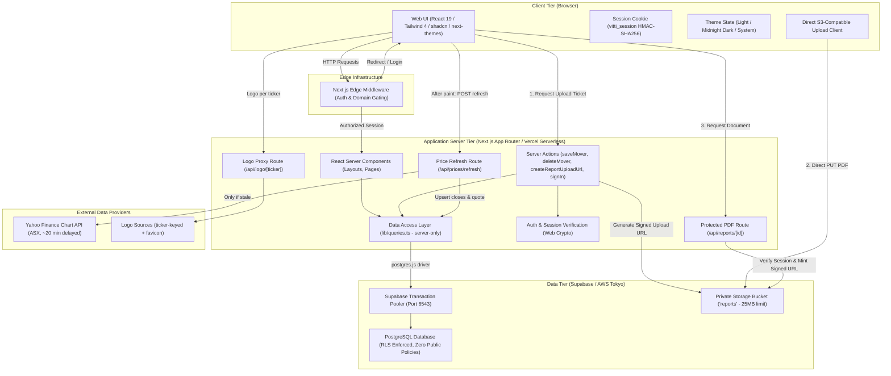
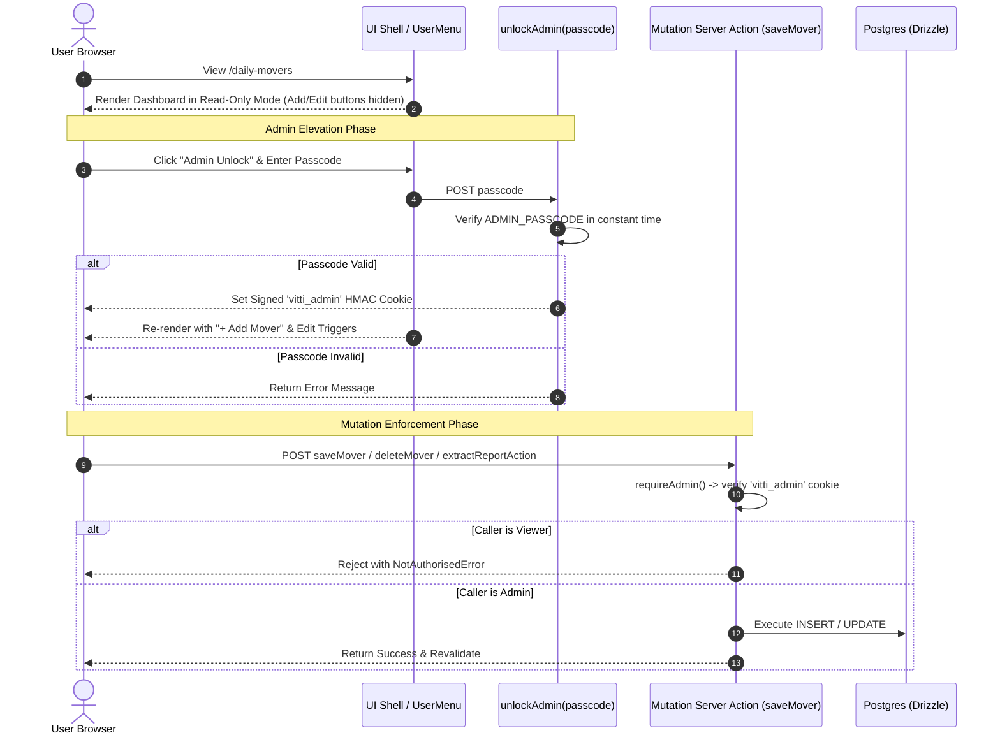
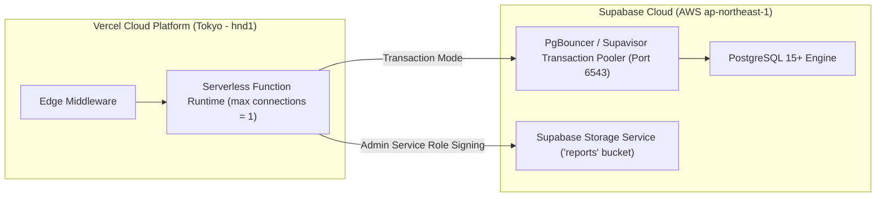

# High-Level Design (HLD) — Daily Movers Dashboard

## 1. Executive Summary & Purpose

The **Daily Movers Dashboard** is an internal research knowledge management platform built for **Vitti Capital**. Its primary objective is to serve as a searchable, structured, and permanent archive of Daily Mover equity research reports on ASX-listed companies.

When investment analysts and portfolio managers review a company that experiences significant price movements, they can immediately retrieve historical research, previous catalyst analyses, and past investment takeaways to understand: *"What did we say last time?"*

---

## 2. Business Context & Problem Statement

### 2.1 The Problem
Historically, equity research reports and daily mover summaries were stored in unstructured formats (PDF files, email threads, chat channels). This caused:
- **Information Fragmentation**: Difficulty searching past commentary across different reporting periods.
- **Entity Disconnect**: Variations in ticker naming (e.g., `JBH` vs `JBH.AX`) splitting research history.
- **Inconsistent Categorisation**: Unstandardized catalyst classification (e.g., "Earnings Result" vs "FY26 Results").
- **Loss of Nuance**: Discrepancies between headline percentage moves, intraday peaks, and final closing figures.
- **File Distribution Risk**: Unrestricted public URLs or large attachments failing serverless payload limits.

### 2.2 The Solution
A unified, web-based intelligence archive featuring:
1. **Normalized Relational Data Model**: Strict entity binding via foreign keys to unique company records.
2. **Standardized Lookups**: Controlled vocabularies for catalysts and analysts.
3. **Derived Metrics**: Deterministic derivation of price movement direction from signed percentage values.
4. **URL-Synchronized Server-Side Filtering**: Performant, deep-linkable search, catalyst filtering, date-range filtering, and pagination handled entirely at the database layer.
5. **Direct-to-Storage PDF Management**: Direct browser-to-storage signed uploads bypassing serverless payload limits, coupled with short-lived (60s) signed download URLs.
6. **Role-Gated Research Operations**: Distinction between research consumers (Viewers) and research authors (Admins).
7. **Institutional Terminal Aesthetics**: Purpose-built financial UI featuring Light / Midnight Navy Dark theme toggle, Plus Jakarta Sans & JetBrains Mono typography, and high-density directional metrics.

---

## 3. High-Level System Architecture

The application adopts a **Modern Server-First Architecture** utilizing Next.js App Router, React Server Components (RSC), Drizzle ORM, Supabase Postgres, and Supabase Private Storage.

---

## 4. Technology Stack & Component Justifications

| Tier / Function | Technology | Justification & Architectural Role |
| :--- | :--- | :--- |
| **Application Framework** | **Next.js 16 (App Router)** | Hybrid SSR/RSC rendering model, zero-client-bundle data fetching, native streaming, Server Actions for mutations. |
| **Language** | **TypeScript 5** | Strict end-to-end type safety spanning database schemas, Zod validation schemas, and UI components. |
| **Styling & Design System** | **Tailwind CSS 4 + shadcn/ui** | Design-token-driven styling, accessible Base UI/Radix primitives, Lucide React icons. |
| **Theming System** | **next-themes** | Client-side Light / Midnight Navy Dark / System theme switching with hydration safety and local storage persistence. |
| **Typography** | **Plus Jakarta Sans + JetBrains Mono** | High-legibility geometric UI typography paired with developer/financial-grade monospace figures for tickers and percentage metrics. |
| **AI Extraction Engine** | **Anthropic Claude 3.5 Sonnet** | Native multimodal document parser extracting structured equity research metadata from raw PDF bytes. |
| **Market Data** | **Yahoo Finance chart endpoint** | Keyless ASX daily closes and latest prices (`{TICKER}.AX`), one request per ticker. Isolated behind a `MarketDataProvider` interface so a licensed feed can replace it in a single line. |
| **Database** | **PostgreSQL (Supabase)** | Relational integrity (FK constraints), JSONB support for raw extractions, performant B-Tree indexes, transaction pooling. |
| **Object-Relational Mapping (ORM)** | **Drizzle ORM + postgres.js** | Type-safe SQL builder with minimal runtime overhead, explicit query composition, seamless migration tooling. |
| **Object Storage** | **Supabase Private Storage (`reports`)** | Encrypted, private bucket storage for Daily Mover PDF reports with server-signed upload and download tokens. |
| **Data Validation** | **Zod** | Runtime contract enforcement for form submissions, Server Action payloads, and query parameter parsing. |
| **Session Security** | **Web Crypto API (HMAC-SHA256)** | Runtime-agnostic cryptographic signing compatible with both Edge Middleware and Node.js Serverless runtimes. |
| **Hosting & Compute** | **Vercel Serverless (Tokyo - `hnd1`)** | Co-located with Supabase Tokyo DB (`ap-northeast-1`) to minimize database query latency. |

---

## 5. Core Architectural Decisions & Principles

### 5.1 Relational Integrity via `company_id` Foreign Keys
- **Decision**: Daily mover records link strictly to the `companies.id` primary key rather than raw ticker strings.
- **Rationale**: ASX tickers can have exchange extensions (`.AX`), class shares, or rebranding. An immutable integer foreign key guarantees that all research history for a company aggregates into a single timeline.

### 5.2 Deterministic Direction Derivation
- **Decision**: Direction (`up` / `down`, `↑` / `↓`, "Up" / "Down") is never stored as an independent column in the database; it is computed deterministically from `move_pct`.
- **Rationale**: Prevents data corruption where an explicit string field could contradict the numeric move percentage. Validation strictly forbids `0%` moves (as non-movers).

### 5.3 Automated PDF Extraction & Entity Auto-Resolution
- **Decision**: Analysts can drop a Daily Mover PDF to trigger `extractReportAction()`. Claude 3.5 Sonnet parses the document and extracts structured attributes. The server action automatically resolves or creates missing company entities and links catalyst/analyst foreign keys before pre-populating the UI form.
- **Rationale**: Eliminates manual data entry while preserving human oversight, guaranteeing that research notes, catalysts, and signed percentage moves are captured accurately in seconds.

### 5.4 Direct-to-Storage PDF Upload Pipeline
- **Decision**: PDF files upload directly from the browser to Supabase Storage via signed upload tickets minted by `createReportUploadUrl()`, rather than streaming through Next.js Server Actions.
- **Rationale**: Vercel caps request bodies at 4.5 MB and Next.js caps Server Action bodies at 1 MB by default. Routine 5–20 MB research reports would fail in serverless production. Direct upload avoids serverless execution limits and prevents memory exhaustion.

### 5.5 Time-Limited Private PDF Delivery (`/api/reports/[id]`)
- **Decision**: The `reports` storage bucket is strictly private (zero public access). All downloads route through `/api/reports/[id]`, which authenticates the user session and issues a **60-second signed download URL**.
- **Rationale**: Ensures report storage keys cannot be accessed anonymously and links shared outside authorized sessions expire immediately.

### 5.5 Server-Side SQL Filtering & URL State
- **Decision**: Full-text search, catalyst filtering, direction filtering, date ranges, and sorting execute directly in PostgreSQL queries. Filter state resides entirely in the URL query string (`?q=&catalyst=&from=&to=&sort=&dir=`).
- **Rationale**: Guarantees sub-millisecond query execution and deep-linkable shareability.

### 5.6 Standardized Institutional Theme Architecture
- **Decision**: Implementation of a dual theme system:
  - **Dark Mode**: Rich **Midnight Navy Blue** (`oklch(0.13 0.032 255)`) palette with subtle luminous borders and glowing green/red directional indicators.
  - **Light Mode**: Crisp slate-tinted canvas (`oklch(0.985 0.008 245)`) with high-contrast surfaces.
- **Rationale**: Enhances readability during extended research sessions and caters to diverse analyst workspace environments.

### 5.7 Server-Resolved Company Logos (`<CompanyLogo />` + `/api/logo/[ticker]`)
- **Decision**: A resilient, zero-broken-image brand logo pipeline combining:
  1. **Instant Monogram Base Layer**: Immediate render of a deterministic two-letter ticker tile on a vibrant background.
  2. **Ticker-Keyed Resolution First**: The proxy resolves logos from the ticker itself, so a freshly uploaded mover gets a logo with nothing registered in advance — no hardcoded ticker-to-domain table to go stale.
  3. **Name-Derived Domain Fallbacks**: Favicons for `{company}.com.au` / `{company}.com` when the ticker-keyed source misses. Ticker-derived domains are deliberately *not* tried: three-letter tickers collide with whoever owns them (`mac.com.au` served Apple's logo for Metals Acquisition), and a confidently wrong logo is worse than a monogram.
  4. **Smooth Alpha Fade-In**: Branded logos overlay the monogram tile once loading succeeds.
- **Rationale**: Resolving server-side lets the fallback chain see upstream status codes (a cross-origin `` only reports "it failed"), collapses each ticker to one cacheable URL, and keeps third-party hosts from seeing the viewer.

### 5.8 Derived-on-Read Post-Event Return
- **Decision**: Store prices (`company_prices` daily closes + `company_quotes` latest price); derive the Post-Event Return at query time. Nothing in the block is entered by hand.
- **Semantics**: The return is measured from the **report price**, falling back to the ASX close on the move date when none was entered. It stays `NULL` when either price is unknown, so "we don't know" never renders as a flat 0.0%.
- **Refresh Model**: Pull-based, no cron. A page load triggers `/api/prices/refresh` after paint; the service applies a 30-minute TTL, a 6-hour backoff for failed tickers, and a per-run ceiling, so runs are naturally resumable and repeated calls are free. Admins can bypass all three with the **Refresh prices** button, which is admin-gated because one click is a request per covered company against an external provider.
- **Rationale**: Same reasoning as deriving direction from `move_pct` — two copies of a figure eventually disagree. A corrected or late close fixes every window at once, and no one has to return after a week to type a price in.

### 5.9 Recency-First Ordering Architecture
- **Decision**: Companies directory (`/companies`) and Daily Movers table (`/daily-movers`) order entities by `MAX(daily_movers.move_date) DESC NULLS LAST`.
- **Rationale**: Ensures the most actively covered equities and latest research notes automatically surface to the top of the interface.

---

## 6. Authentication, Authorization & Security Architecture

### 6.1 Public-First Read Architecture with Passcode Admin Elevation
- **Public Viewer Access by Default**: All team members and analysts can navigate `/daily-movers`, `/companies`, and `/companies/[ticker]` with zero login barrier. Default sessions carry `{ role: "viewer", canWrite: false }`.
- **Passcode-Based Admin Elevation**: The 2 authorized research authors unlock write mode by providing the secret `ADMIN_PASSCODE` in the `AdminUnlockDialog`.
- **Session Tokens**: Upon passcode verification, a stateless, tamper-proof cookie (`vitti_admin`) containing `{ e: "admin@vitti.capital", x: expiry }` is signed using HMAC-SHA256 with `AUTH_SECRET` via Web Crypto standard primitives (`crypto.subtle`).

### 6.2 Multi-Layered Authorization & Enforcement (Defense-in-Depth)

| Layer | Enforcement Mechanism | Purpose |
| :--- | :--- | :--- |
| **Layer 1: Default Viewer Shell** | `getSessionUser()` defaults to `{ role: "viewer", canWrite: false }` | Renders clean institutional dashboard for everyone with zero login barriers. |
| **Layer 2: Constant-Time Passcode Gate** | `verifyAdminPasscode()` using bitwise loop | Protects admin elevation against timing and brute-force attacks. |
| **Layer 3: Cryptographic Admin Token** | Web Crypto HMAC-SHA256 signed `vitti_admin` cookie | Prevents client-side cookie forgery for privilege escalation. |
| **Layer 4: Mutation Chokepoint** | `requireAdmin()` on all Server Actions (`saveMover`, `deleteMover`, `extractReportAction`, `createReportUploadUrl`) | Strictly enforces that database mutations only execute from validated admin sessions. |
| **Layer 5: Storage Security** | Private Supabase bucket + 60s signed URLs | Prevents unauthenticated access to uploaded research PDFs. |
| **Layer 6: Database Layer (RLS)** | Row-Level Security enabled on all tables with **zero public policies** | Complete lockdown against public Supabase anon key requests. Drizzle connects as table owner to bypass RLS safely. |

---

## 7. Deployment & Infrastructure Architecture

### 7.1 Serverless Connection Management & Environment Variables
- **Local Dev vs Serverless**: `src/db/index.ts` dynamically configures connection pooling:
  - **Local Development**: Connection pool size of `10` to facilitate rapid parallel queries.
  - **Production Serverless (`process.env.VERCEL`)**: Connection pool pinned to `1` per lambda to prevent connection exhaustion against Supabase pooler.
- **Environment Variables**:
  - `DATABASE_URL`: Pooler URI (port 6543, username `postgres.<ref>`).
  - `AUTH_SECRET`: 32-byte cryptographic hex string.
  - `NEXT_PUBLIC_SUPABASE_URL`: Supabase project URL for direct client storage PUT.
  - `NEXT_PUBLIC_SUPABASE_ANON_KEY`: Supabase anon key for client upload authentication.
  - `SUPABASE_SERVICE_ROLE_KEY`: Server-only key used exclusively to mint signed upload/download tokens.

---

## 8. Current Feature Set & Capabilities

1. **Daily Movers Table View (`/daily-movers`)**:
   - Paginated, sortable, and multi-filter table displaying research dates, tickers, company names, catalysts, price movements, move types, and covering analysts.
   - Financial directional move chips (`ArrowUpRight` / `ArrowDownRight`) with emerald gain and rose decline tints.
   - **Documents Column**: Clickable `Report` and `ASX` action buttons per row, with greyed-out visual states when unattached.
   - **Post-Event Performance Block**: Report Price, Current Price (~20 min delayed) and Post-Event Return, refreshed automatically from market data. An inferred report price is marked with a dotted underline; an unknown return shows `—` with the reason on hover.
   - **Price Freshness Control**: A "Prices as of ..." stamp above the table for every viewer, plus an admin-only **Refresh prices** button that fetches every tracked ticker immediately instead of waiting for the automatic sweep.
   - Summary KPI cards showing total published research, covered companies, and filtered counts with micro-gradients and icons.
   - Interactive dialog for creating and editing research entries (admins only).
2. **Report PDF Upload & Direct Delivery**:
   - Drag & drop PDF uploader with progress tracking and direct browser-to-storage upload.
   - Protected download endpoint (`/api/reports/[id]`) with 60-second signed URLs.
3. **Company Research Directory (`/companies`)**:
   - Comprehensive directory of all covered listed entities with sector tags, mover counts, and latest coverage timestamps.
4. **Company Historical Deep-Dive (`/companies/[ticker]`)**:
   - "Most Recent Research Takeaway" hero card with highlight banner and quote icon.
   - Vertical research history timeline connecting chronological notes with directional status nodes.
   - Action links to Daily Mover source reports.
5. **Theme Customization (`ThemeToggle`)**:
   - Seamless switching between Light mode, Midnight Navy Dark mode, and System preference.
6. **Authentication & Session Management (`/login`, `/auth/signout`)**:
   - Single-step email authentication with secure session cookie distribution and audit trail logging in `app_users`.

---

## 9. Future Roadmap & Extensibility

- **Automated LLM Extraction Pipeline**: Background workers parsing uploaded PDFs from Supabase Storage, running structured prompts, and populating `extraction` JSONB for automated diffing.
- **UI Company Management**: Interface for adding and updating company ticker and sector metadata without database seeding.
- **Admin Management Portal**: UI for granting/revoking write permissions in `admin_emails`.
- **Magic Link / MFA Verification**: Transition from domain allowlist identification to cryptographic email verification for public internet exposure.
