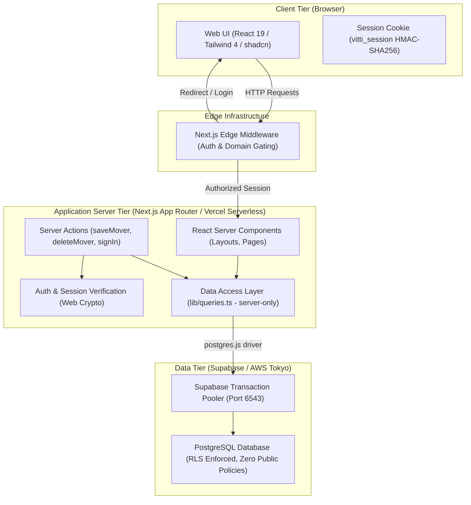
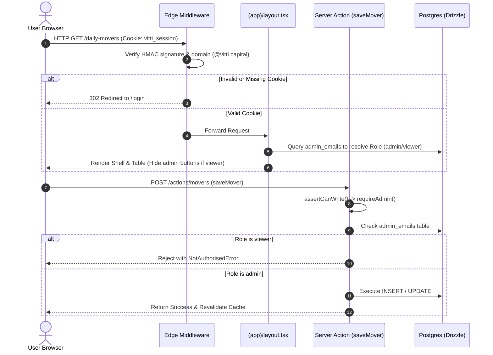
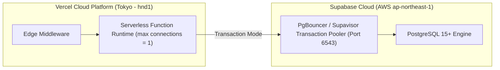

# High-Level Design (HLD) — Daily Movers Dashboard

## 1. Executive Summary & Purpose

The **Daily Movers Dashboard** is an internal research knowledge management platform built for **Vitti Capital**. Its primary objective is to serve as a searchable, structured, and permanent archive of Daily Mover equity research reports on ASX-listed companies.

When investment analysts and portfolio managers review a company that experiences significant price movements, they can immediately retrieve historical research, previous catalyst analyses, and past investment takeaways to understand: *"What did we say last time?"*

---

## 2. Business Context & Problem Statement

### 2.1 The Problem
Historically, equity research reports and daily mover summaries were stored in unstructured formats (PDF files, email threads, chat channels). This caused:
- **Information Fragmentation**: Difficulty searching past commentary across different reporting periods.
- **Entity Disconnect**: Variations in ticker naming (e.g., `JBH` vs `JBH.AX`) splitting research history.
- **Inconsistent Categorisation**: Unstandardized catalyst classification (e.g., "Earnings Result" vs "FY26 Results").
- **Loss of Nuance**: Discrepancies between headline percentage moves, intraday peaks, and final closing figures.

### 2.2 The Solution
A unified, web-based intelligence archive featuring:
1. **Normalized Relational Data Model**: Strict entity binding via foreign keys to unique company records.
2. **Standardized Lookups**: Controlled vocabularies for catalysts and analysts.
3. **Derived Metrics**: Deterministic derivation of price movement direction from signed percentage values.
4. **URL-Synchronized Server-Side Filtering**: Performant, deep-linkable search, catalyst filtering, date-range filtering, and pagination handled entirely at the database layer.
5. **Role-Gated Research Operations**: Distinction between research consumers (Viewers) and research authors (Admins).

---

## 3. High-Level System Architecture

The application adopts a **Modern Server-First Architecture** utilizing Next.js App Router, React Server Components (RSC), Drizzle ORM, and Supabase Postgres.

---

## 4. Technology Stack & Component Justifications

| Tier / Function | Technology | Justification & Architectural Role |
| :--- | :--- | :--- |
| **Application Framework** | **Next.js 16 (App Router)** | Hybrid SSR/RSC rendering model, zero-client-bundle data fetching, native streaming, Server Actions for mutations. |
| **Language** | **TypeScript 5** | Strict end-to-end type safety spanning database schemas, Zod validation schemas, and UI components. |
| **Styling & Design System** | **Tailwind CSS 4 + shadcn/ui** | Design-token-driven styling, accessible Base UI/Radix primitives, dark-themed institutional layout. |
| **Database** | **PostgreSQL (Supabase)** | Relational integrity (FK constraints), JSONB support for raw extractions, performant B-Tree indexes, transaction pooling. |
| **Object-Relational Mapping (ORM)** | **Drizzle ORM + postgres.js** | Type-safe SQL builder with minimal runtime overhead, explicit query composition, seamless migration tooling. |
| **Data Validation** | **Zod** | Runtime contract enforcement for form submissions, Server Action payloads, and query parameter parsing. |
| **Session Security** | **Web Crypto API (HMAC-SHA256)** | Runtime-agnostic cryptographic signing compatible with both Edge Middleware and Node.js Serverless runtimes. |
| **Hosting & Compute** | **Vercel Serverless (Tokyo - `hnd1`)** | Co-located with Supabase Tokyo DB (`ap-northeast-1`) to minimize database query latency. |

---

## 5. Core Architectural Decisions & Principles

### 5.1 Relational Integrity via `company_id` Foreign Keys
- **Decision**: Daily mover records link strictly to the `companies.id` primary key rather than raw ticker strings.
- **Rationale**: ASX tickers can have exchange extensions (`.AX`), class shares, or rebranding. An immutable integer foreign key guarantees that all research history for a company aggregates into a single timeline.

### 5.2 Deterministic Direction Derivation
- **Decision**: Direction (`up` / `down`, `↑` / `↓`, "Up" / "Down") is never stored as an independent column in the database; it is computed deterministically from `move_pct`.
- **Rationale**: Prevents data corruption where an explicit string field could contradict the numeric move percentage. Validation strictly forbids `0%` moves (as non-movers).

### 5.3 Server-Side SQL Filtering & URL State
- **Decision**: Full-text search, catalyst filtering, direction filtering, date ranges, and sorting execute directly in PostgreSQL queries. Filter state resides entirely in the URL query string (`?q=&catalyst=&from=&to=&sort=&dir=`).
- **Rationale**: 
  - Guarantees sub-millisecond query execution even as the archive grows to tens of thousands of records.
  - Ensures all filtered states and specific company views are shareable, bookmarkable, and compatible with browser forward/back navigation.

### 5.4 Lookup Table for Catalysts
- **Decision**: Catalysts use a fixed lookup table (`catalysts`) with slugs and display labels rather than free-text strings.
- **Rationale**: Prevents categorization drift and fragmented filter facets (e.g., "Earnings Result" vs "FY26 Results").

### 5.5 Forward-Compatible Extraction Schema
- **Decision**: The `daily_movers` table contains `extraction` (`jsonb`) and `report_storage_path` (`text`) fields.
- **Rationale**: Reserves structured storage for automated PDF ingestion pipelines and LLM extraction outputs without requiring future schema migrations.

---

## 6. Authentication & Security Architecture

### 6.1 Authentication Mechanism (Domain Allowlist Identification)
- **Model**: Frictionless corporate email identification restricted to `@vitti.capital`.
- **Session Tokens**: Stateless, tamper-proof cookie (`vitti_session`) containing `{ email, expiry }` signed with an HMAC-SHA256 secret (`AUTH_SECRET`).
- **Cryptographic Standard**: Web Crypto API standard primitives (`crypto.subtle`) ensuring cross-runtime compatibility between Edge Middleware and Node Serverless.

### 6.2 Multi-Layered Authorization & Enforcement (Defense-in-Depth)

| Layer | Enforcement Mechanism | Purpose |
| :--- | :--- | :--- |
| **Layer 1: Edge Middleware** | HMAC token verification + `@vitti.capital` domain check | Blocks unauthorized traffic at edge; redirects to `/login`. |
| **Layer 2: Server Layout** | Server-side `getSessionUser()` verification | Redundant fail-safe preventing data leaks if middleware is misconfigured. |
| **Layer 3: Mutation Chokepoint** | `assertCanWrite()` / `requireAdmin()` in Server Actions | Cryptographic and database-backed verification that caller is in `admin_emails`. |
| **Layer 4: Database Layer (RLS)** | Row-Level Security enabled on all tables with **zero public policies** | Complete lockdown against public Supabase anon key requests. Drizzle connects as table owner to bypass RLS safely. |

### 6.3 Security Hardening & Credential Protection
- **Credential Redaction**: `lib/db-error.ts` scrubs database connection strings, passwords, and host credentials from runtime error logs and user-facing UI screens.
- **Open Redirect Protection**: `safeNextPath()` validates post-login redirect targets against origin boundaries to eliminate malicious redirects.
- **Fail-Closed Permissions**: Database outages default user privileges to `viewer` to prevent unauthorized write escalation during degraded service.

---

## 7. Deployment & Infrastructure Architecture

### 7.1 Serverless Connection Management
- **Local Dev vs Serverless**: `src/db/index.ts` dynamically configures connection pooling:
  - **Local Development**: Connection pool size of `10` to facilitate rapid parallel queries.
  - **Production Serverless (`process.env.VERCEL`)**: Connection pool pinned to `1` per lambda to prevent connection exhaustion against Supabase pooler.
- **Transaction Mode Pooler**: Configured with `prepare: false` for compatibility with Supabase's transaction pooler (port 6543).

### 7.2 Geographic Co-location
- `vercel.json` pins serverless function execution to `hnd1` (Tokyo), co-located with Supabase's AWS Tokyo region (`ap-northeast-1`), keeping round-trip latency under 15ms.

---

## 8. Current Feature Set & Capabilities

1. **Daily Movers Table View (`/daily-movers`)**:
   - Paginated, sortable, and multi-filter table displaying research dates, tickers, company names, catalysts, price movements, move types, and covering analysts.
   - Summary statistics cards showing total movers saved, companies covered, and matching filter results.
   - Interactive dialog for creating and editing research entries (admins only).
2. **Company Research Archive (`/companies`)**:
   - Comprehensive directory of all covered listed entities with mover counts and latest coverage timestamps.
3. **Company Historical Deep-Dive (`/companies/[ticker]`)**:
   - Chronological research timeline ("What did we say last time?") highlighting the latest key takeaway and historical catalysts.
   - External links to Daily Mover source reports and official ASX announcements.
4. **Authentication & Session Management (`/login`, `/auth/signout`)**:
   - Single-step email authentication with secure session cookie distribution and audit trail logging in `app_users`.

---

## 9. Future Roadmap & Extensibility

- **Automated PDF Upload & LLM Extraction**: Direct PDF upload to Supabase Storage with automated extraction populating `daily_movers` and `extraction` JSONB.
- **UI Company Management**: Interface for adding and updating company ticker and sector metadata without database seeding.
- **Admin Management Portal**: UI for granting/revoking write permissions in `admin_emails`.
- **Magic Link / MFA Verification**: Transition from domain allowlist identification to cryptographic email verification for public internet exposure.
