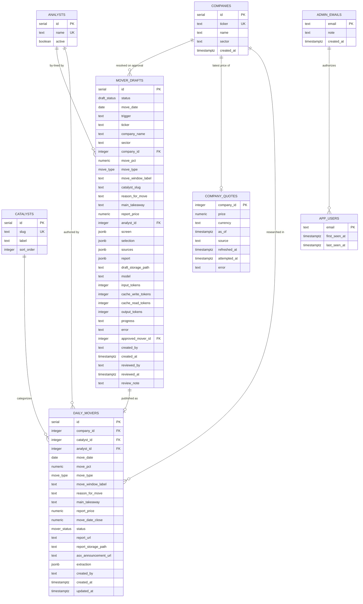
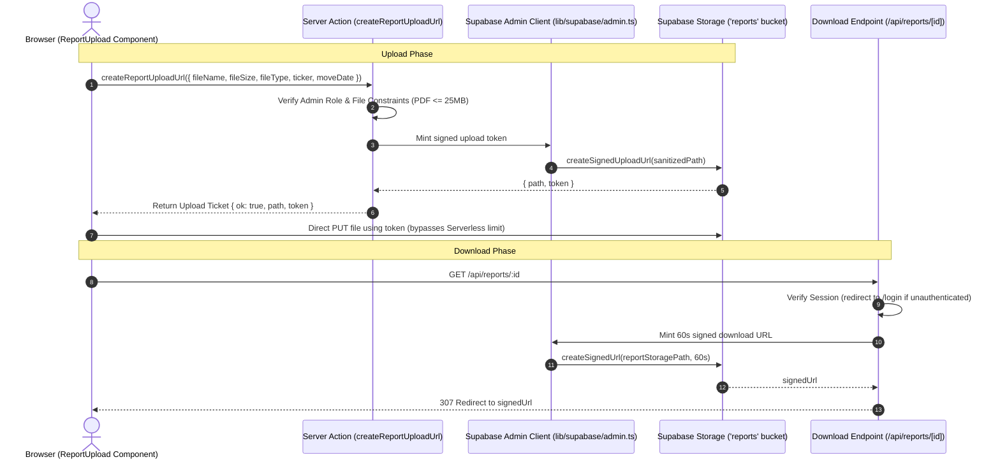
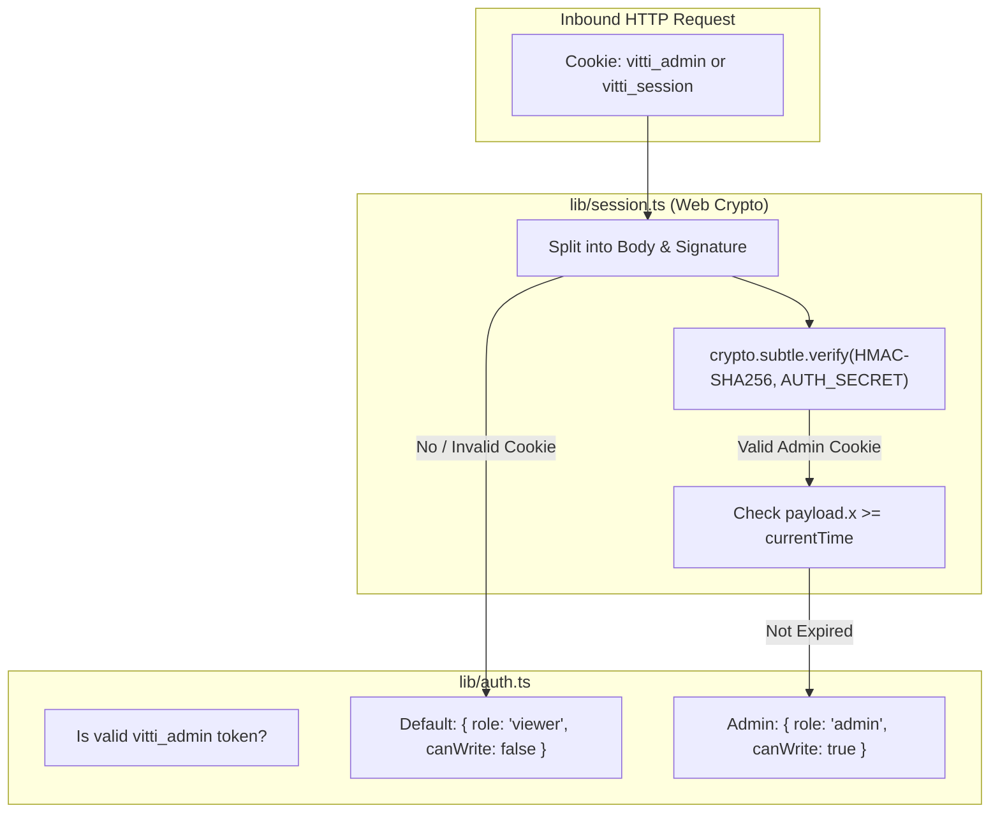
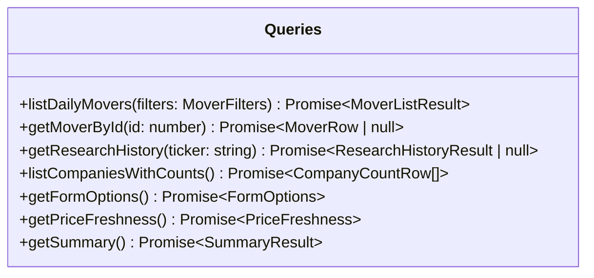
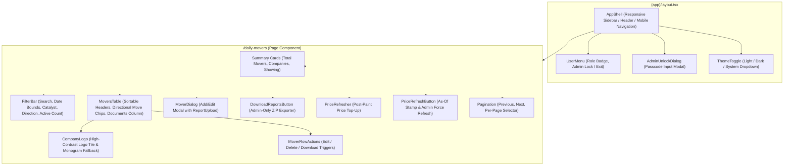

# Low-Level Design (LLD) — Daily Movers Dashboard

## 1. Introduction

This Low-Level Design (LLD) document provides a comprehensive technical specification of the internal code structures, data schemas, API contracts, execution flows, and state management mechanisms implemented in the **Daily Movers Dashboard**.

---

## 2. Directory & Module Structure

```
daily-movers-dashboard/
├── drizzle/                     # Database migrations & SQL setup scripts
│   ├── 0000_big_enchantress.sql
│   ├── 0001_military_senator_kelly.sql
│   ├── 0002_post_event_returns.sql # mover_status, company_prices, company_quotes
│   ├── 0003_drop_unused_columns_indexes.sql # dead columns & redundant indexes
│   ├── 0004_mover_anchor_close.sql # move_date_close; drops company_prices
│   ├── 0005_mover_drafts.sql    # mover_drafts table + draft_status enum
│   ├── 0006_draft_cache_tokens.sql # cache_write_tokens, cache_read_tokens
│   └── auth-setup.sql           # RLS, app_users table, admin_emails seed
├── scripts/                     # Operational automation scripts
│   ├── apply-sql.mts            # Idempotent statement-by-statement SQL runner
│   ├── download-reports.mts     # Batch CLI script to download all attached PDFs to a local folder
│   └── storage-setup.mts        # Private Supabase Storage bucket initialization
├── src/
│   ├── actions/                 # Next.js Server Actions (Mutations)
│   │   ├── admin-auth.ts        # unlockAdmin, lockAdmin
│   │   ├── drafts.ts            # startDraft, approveDraft, rejectDraft, reapDrafts
│   │   ├── extract.ts           # extractReportAction (Claude PDF AI extraction)
│   │   ├── movers.ts            # saveMover, deleteMover
│   │   └── reports.ts           # createReportUploadUrl (signed upload tickets)
│   ├── app/                     # Next.js App Router routes & pages
│   │   ├── (app)/               # Protected application layout group
│   │   │   ├── companies/       # Company directory & research history
│   │   │   │   ├── [ticker]/    # Single company research timeline
│   │   │   │   └── page.tsx
│   │   │   ├── daily-movers/    # Main Daily Movers table & filters
│   │   │   │   └── page.tsx
│   │   │   ├── mover-studio/    # AI draft review queue (admin only)
│   │   │   │   └── page.tsx
│   │   │   └── layout.tsx       # Auth protection barrier & shell wrapper
│   │   ├── api/                 # API route handlers
│   │   │   ├── cron/daily-mover/ # Weekday scheduled draft, Sydney-time gated
│   │   │   │   └── route.ts
│   │   │   ├── drafts/[id]/pdf/ # Admin-only signed URL for an unapproved draft
│   │   │   │   └── route.ts
│   │   │   ├── extract/         # Multipart PDF AI extraction route handler
│   │   │   ├── logo/[ticker]/   # Multi-source company logo proxy with HTML scraper
│   │   │   │   └── route.ts
│   │   │   ├── prices/refresh/  # POST: stale top-up, or {force:true} for admins
│   │   │   │   └── route.ts
│   │   │   ├── reports/[id]/    # Protected 60-second signed PDF redirect handler
│   │   │   │   └── route.ts
│   │   │   └── reports/download-all/ # Admin-protected batch ZIP archive stream
│   │   │       └── route.ts
│   │   ├── login/               # Passwordless identification UI & actions
│   │   ├── globals.css          # Tailwind CSS 4 theme, typography & OKLCH color tokens
│   │   ├── layout.tsx           # Root HTML layout with ThemeProvider and fonts
│   │   └── page.tsx             # Root redirect to /daily-movers
│   ├── components/              # UI Component Library
│   │   ├── mover-studio/        # Draft queue, review card, inline report preview, evidence list
│   │   ├── daily-movers/        # Domain-specific components
│   │   │   ├── company-combobox.tsx
│   │   │   ├── download-reports-button.tsx # Admin-gated batch ZIP download trigger
│   │   │   ├── filter-bar.tsx
│   │   │   ├── mover-dialog.tsx # Add/Edit modal with Claude AI Auto-Fill dropzone
│   │   │   ├── mover-row-actions.tsx
│   │   │   ├── movers-table.tsx # Table with directional chips, performance columns & Documents
│   │   │   ├── pagination.tsx
│   │   │   ├── price-refresh-button.tsx # "As of" stamp + admin force-refresh
│   │   │   ├── price-refresher.tsx # Post-paint stale-price top-up trigger
│   │   │   └── report-upload.tsx# Direct browser-to-storage PDF uploader
│   │   ├── ui/                  # shadcn/ui Base UI & Radix primitives
│   │   ├── admin-unlock-dialog.tsx # Passcode entry modal for admin mode
│   │   ├── app-shell.tsx        # Navigation sidebar, branding & mobile header
│   │   ├── company-logo.tsx     # High-contrast adaptive logo tile with monogram fallback
│   │   ├── db-not-configured.tsx# Fallback diagnostic alerts
│   │   ├── nav-link.tsx         # Active-state navigation anchor with icons
│   │   ├── theme-provider.tsx   # next-themes client wrapper
│   │   ├── theme-toggle.tsx     # Light / Dark / System theme switcher
│   │   └── user-menu.tsx        # User profile, role badge & admin unlock/lock trigger
│   ├── db/                      # Database connection & schema definitions
│   │   ├── index.ts             # Connection caching & pooler configuration
│   │   ├── schema.ts            # Drizzle ORM table & relation schemas
│   │   └── seed.ts              # Idempotent database seed script
│   ├── lib/                     # Utilities, helpers & business logic
│   │   ├── ai/                  # AI & LLM modules
│   │   │   ├── announcement-text.ts # Announcement PDFs -> prompt text (unpdf, visual fallback)
│   │   │   ├── anthropic.ts     # Extraction client (uploaded reports)
│   │   │   ├── client.ts        # Shared Anthropic client, model choices, token accounting
│   │   │   └── mover-draft.ts   # The two drafting calls: select a mover, write the report
│   │   ├── asx/                 # ASX listing universe, announcements & computed movers board
│   │   │   ├── announcements.ts # Legacy statistics servlet parser + PDF access gate
│   │   │   ├── board.ts         # screenBoards(): universe -> quotes -> liquidity screen -> ranked
│   │   │   ├── index.ts         # Server-side entry point
│   │   │   ├── provider.ts      # AsxDataProvider contract & shared types
│   │   │   ├── source.ts        # Provider selection — single swap point
│   │   │   ├── types.ts         # Client-safe types, DEFAULT_SCREEN, SCREEN_LIMITS
│   │   │   └── universe.ts      # ASX company directory CSV
│   │   ├── auth-config.ts       # Domain & path matching (edge safe)
│   │   ├── auth.ts              # RBAC & session verification (server-only)
│   │   ├── catalysts.ts         # The closed catalyst vocabulary, defined once
│   │   ├── db-error.ts          # Postgres error code parser & credential scrubbing
│   │   ├── drafts/              # Mover Studio pipeline & reads
│   │   │   ├── generate.ts      # runDraftPipeline, shouldRunScheduled, reapStaleGenerating
│   │   │   ├── queries.ts       # Draft queue reads (server-only)
│   │   │   ├── trading-day.ts   # Australia/Sydney date & session arithmetic (client-safe)
│   │   │   └── types.ts         # Client-safe draft row shapes & cost estimation
│   │   ├── format.ts            # Date, percentage & price formatters
│   │   ├── market/              # Market data (ASX prices & profile discovery)
│   │   │   ├── index.ts         # Provider selection — single swap point
│   │   │   ├── provider.ts      # MarketDataProvider contract & shared types
│   │   │   ├── refresh.ts       # Staleness rules, backfill & upserts (server-only)
│   │   │   └── yahoo.ts         # Yahoo Finance chart adapter & assetProfile scraper
│   │   ├── movers.ts            # Shared runtime types, return derivation & pagination constants
│   │   ├── queries.ts           # Drizzle SQL query builder (server-only)
│   │   ├── report/              # Daily Mover report document
│   │   │   ├── render.ts        # renderReportPdf + draft storage keys (server-only)
│   │   │   ├── template.tsx     # The react-pdf document
│   │   │   └── types.ts         # Typed page blocks, disclaimer constant, validation
│   │   ├── session.ts           # Web Crypto HMAC-SHA256 token manager
│   │   ├── storage.ts           # Storage path sanitization, upload helper & limits
│   │   ├── supabase/admin.ts    # Service-role Supabase admin client
│   │   ├── use-query-params.ts  # Client hook for URL searchParams synchronization
│   │   ├── utils.ts             # clsx & tailwind-merge helper
│   │   └── validation.ts        # Zod validation schema & form parsers
│   └── middleware.ts            # Edge request interception & session gating
```

---

## 3. Database Schema & Data Models

### 3.1 Entity Relationship Diagram (ERD)



### 3.2 Detailed Table Specifications

#### 1. `companies`
| Column | Type | Constraints | Description |
| :--- | :--- | :--- | :--- |
| `id` | `serial` | Primary Key | Unique internal company ID. |
| `ticker` | `text` | NOT NULL, Unique Index | Primary ticker code (e.g., `JBH`, `SPZ`). |
| `name` | `text` | NOT NULL, B-Tree Index | Full legal/trading name. |
| `sector` | `text` | Nullable | GICS industry sector. |
| `created_at` | `timestamptz` | NOT NULL, Default `now()` | Record creation timestamp. |

#### 2. `catalysts`
| Column | Type | Constraints | Description |
| :--- | :--- | :--- | :--- |
| `id` | `serial` | Primary Key | Unique catalyst ID. |
| `slug` | `text` | NOT NULL, Unique Index | Machine-readable identifier (e.g., `earnings_result`). |
| `label` | `text` | NOT NULL | Human-readable label (e.g., `Earnings Result`). |
| `sort_order` | `integer` | NOT NULL, Default `0` | UI dropdown presentation sort order. |

#### 3. `analysts`
| Column | Type | Constraints | Description |
| :--- | :--- | :--- | :--- |
| `id` | `serial` | Primary Key | Unique analyst ID. |
| `name` | `text` | NOT NULL, Unique Index | Full name of the research analyst. |
| `active` | `boolean` | NOT NULL, Default `true` | Status flag for active research assignment. |

#### 4. `daily_movers`
| Column | Type | Constraints | Description |
| :--- | :--- | :--- | :--- |
| `id` | `serial` | Primary Key | Unique daily mover record ID. |
| `company_id` | `integer` | NOT NULL, FK -> `companies(id)` (`ON DELETE RESTRICT`) | Associated company. |
| `catalyst_id` | `integer` | NOT NULL, FK -> `catalysts(id)` (`ON DELETE RESTRICT`) | Categorized catalyst. |
| `analyst_id` | `integer` | Nullable, FK -> `analysts(id)` (`ON DELETE SET NULL`) | Authoring research analyst. |
| `move_date` | `date` | NOT NULL | Calendar date of report and price move (`YYYY-MM-DD`). |
| `move_pct` | `numeric(6,2)` | NOT NULL | Signed price change percentage (e.g. `-11.50`, `+20.60`). |
| `move_type` | `move_type` enum | NOT NULL (`intraday` \| `closing`) | Pricing timeframe type. |
| `move_window_label`| `text` | Nullable | Verbatim phrasing from PDF (e.g., "Morning Trade"). |
| `reason_for_move` | `text` | NOT NULL (Max 1000 chars) | Detailed catalyst analysis. |
| `main_takeaway` | `text` | NOT NULL (Max 1000 chars) | Core investment conclusion for future reference. |
| `report_price` | `numeric(12,4)` | Nullable | Share price recorded at time of report publication. When null, the post-event return falls back to `move_date_close`. |
| `move_date_close` | `numeric(12,4)` | Nullable | ASX close on (or last before) `move_date` — the fallback anchor. Resolved once from market data and then never touched, since a past close does not change. Null only where the provider has no data for that date. |
| `status` | `mover_status` enum | NOT NULL, Default `new` (`new` \| `reviewed` \| `follow_up`) | **Vestigial.** The Status column was removed from the UI; the column is retained so reversing that needs no destructive migration. Nothing reads or writes it. |
| `report_url` | `text` | Nullable | External link to research PDF/document. |
| `report_storage_path`| `text` | Nullable | Relative object key in private `reports` bucket. |
| `asx_announcement_url`| `text` | Nullable | **Vestigial.** The ASX announcement link was removed from the UI, the Add/Edit form and the PDF extraction; the column is retained so reversing that needs no destructive migration. It was null on every row at removal. |
| `extraction` | `jsonb` | Nullable | Verbatim raw LLM/OCR structured JSON output. |
| `created_by` | `text` | Nullable | Email address of the creator. |
| `created_at` | `timestamptz` | NOT NULL, Default `now()` | Record creation timestamp. |
| `updated_at` | `timestamptz` | NOT NULL, Default `now()` | Last modification timestamp. |

#### 5. `company_quotes`
One row per company holding the latest price, overwritten in place, plus the refresh bookkeeping.

| Column | Type | Constraints | Description |
| :--- | :--- | :--- | :--- |
| `company_id` | `integer` | Primary Key, FK -> `companies(id)` (`ON DELETE CASCADE`) | Company. |
| `price` | `numeric(12,4)` | Nullable | Latest price, ~20 minutes delayed. |
| `currency` | `text` | Nullable | Provider-reported currency (`AUD`). |
| `as_of` | `timestamptz` | Nullable | Provider's timestamp for `price`, not our fetch time. |
| `source` | `text` | Nullable | Provider that supplied it. |
| `refreshed_at` | `timestamptz` | Nullable | Last refresh that returned a price. |
| `attempted_at` | `timestamptz` | NOT NULL, Default `now()` | Last attempt, successful or not. **Staleness is measured from this**, so a delisted ticker isn't retried on every page load. |
| `error` | `text` | Nullable | Reason the last attempt failed; null after a success. Stale prices are kept rather than blanked. |

---

## 3.3 Post-Event Return Pipeline

Nothing here is entered by hand. The return is **derived on read** from stored prices rather than stored as a number — the same reasoning as `move_pct` driving direction, so a corrected close fixes every window at once.

| Layer | File | Responsibility |
| :--- | :--- | :--- |
| Provider contract | `src/lib/market/provider.ts` | `MarketDataProvider` (`fetchQuotes` + `fetchSessionMoves` + `fetchCloses`), `DailyClose`, `Quote`, `SessionMove`, `UnknownSymbolError`. Nothing above this layer sees a provider's response format. Split three ways because the work genuinely differs: current prices are wanted for every covered company on a schedule and batch cheaply; session moves are wanted for the whole ~1,200-ticker screening universe once a day and are read, ranked and discarded rather than stored; closes are only needed for the few companies missing history. |
| Session moves | `src/lib/market/yahoo.ts` | `fetchSessionMoves` batches 50 symbols per request with 4 in flight (~25 requests for the whole universe). A chunk that fails is logged and its tickers are simply absent, so one bad batch out of twenty-five cannot cost the day's board. Turnover is derived as `price × volume` — providers report volume in shares, and a liquidity screen has to be in dollars or a 500-million-share move in a half-cent stock passes it. |
| Yahoo adapter | `src/lib/market/yahoo.ts` | Built on the `yahoo-finance2` package, which owns the cookie/crumb handshake `quote()` requires, response validation and retries. `fetchQuotes` batches up to 40 symbols per request; tickers the quote endpoint skips (suspended listings such as `OPT.AX`) fall back to the price in a chart response's metadata. Bars are dated by shifting the bar's opening instant by the exchange's `gmtoffset` -- a no-op under AEST, but required under daylight saving, where 10:00 local is 23:00 UTC the previous day. |
| Provider selection | `src/lib/market/index.ts` | Single-line swap point for a licensed feed. |
| Refresh service | `src/lib/market/refresh.ts` | **Quotes**: every due company in one batched request, then a single multi-row upsert (`excluded.*`) rather than one round trip each -- the database is in Tokyo, and sequential upserts dominated the runtime. **Anchors**: only for movers whose `move_date_close` is still null (i.e. newly added ones), capped at 20 per run with 4 concurrent requests; normally there are none. Staleness is a 30 min TTL with a 6 h backoff after a failure; concurrent callers are coalesced by an in-flight promise keyed on mode. |
| Trigger route | `src/app/api/prices/refresh/route.ts` | `POST`. Unauthenticated for the automatic stale-only sweep (self-limiting via TTL + ceiling); `{ force: true }` requires `canWrite`, since one forced click is a request per covered company. Returns `{ due, refreshed, failed }`. |
| Client trigger | `src/components/daily-movers/price-refresher.tsx` | Fires after paint, calls `router.refresh()` only when something changed. |
| Manual control | `src/components/daily-movers/price-refresh-button.tsx` | Shows "Prices as of ..." (from `getPriceFreshness()`) to everyone, plus a force-refresh button for admins. Forced runs ignore the TTL and the per-run ceiling. |
| Derivation | `src/lib/queries.ts`, `src/lib/movers.ts` | The anchor is `coalesce(report_price, move_date_close)` -- a plain column read, previously a correlated subquery over the price series. `pctChange` turns it and the current price into the return. |

Semantics:

- **Anchor** = `report_price`, else `move_date_close` (the last close on or before `move_date`; `<=` rather than `=` because a move date can land on a day with no close of its own). Resolved once per mover, on the refresh after it is added. An inferred anchor is marked in the UI with a dotted underline.
- **Post-Event Return** = anchor → current price. Null when either side is unknown, rendered as `—` with the reason on hover rather than as a misleading 0.0%.
- Fixed-window returns (1W / 1M) were removed as unnecessary. The `company_prices` daily series went with them: it existed to find a close anywhere inside a window, and the only historical price still read is the anchor — one value per mover, now stored on the mover itself. That was ~2,000 rows serving 39 numbers.

Refresh is pull-based with no cron: a page load asks, and the service decides whether anything is due. A run that hits its ceiling is resumed by the next request, since staleness is re-evaluated each time. Adding an older mover for an already-tracked company automatically triggers a history backfill on the next refresh.

*(Historical note, now moot: while the daily series existed,)* **history was considered complete once a close existed at or before the earliest move date** -- which is exactly what the anchor lookup needs -- not once it reaches the requested `move_date - 10 days`. The lead days widen the *request* so a move date after a long weekend still has a preceding close, but the first trading day Yahoo returns is usually a day or two later, so comparing against the requested date never matched: 16 companies re-fetched and re-upserted their entire history on every refresh (~700 wasted row writes each time, measured at 511 in one sweep). With the correct check a steady-state refresh writes 47 quote rows in one statement and ~0 price rows.

The one remaining exception is a ticker whose history Yahoo cannot cover back to its move date at all (`OPT`, suspended since July): its anchor can never be satisfied, so it re-fetches ~23 bars per refresh. Bounding that properly needs a stored "history requested from" marker; it is left as a known, measured cost rather than hidden.

---

## 3.4 `mover_drafts` — Why a Separate Table

`mover_drafts` is deliberately **not** a `status` column on `daily_movers`.

Every row in `daily_movers` is approved research, which is precisely what makes
"what did we say last time?" answerable. A status column would require every
existing query — the table view, the company timeline, the summary counts, the
ZIP export — to carry `WHERE status = 'approved'`, and a single omission would
surface an unreviewed machine draft as Vitti's published position.

Consequences of the split, each deliberate:

| Decision | Reason |
| --- | --- |
| `ticker` is text, not a `company_id` FK | The pick happens before any company is resolved. Creating a `companies` row for a draft would leave a stub in the directory for every rejection. The FK is populated only on approval. |
| `catalyst_slug` is text, not a `catalyst_id` FK | Same: resolved against `catalysts` at approval time. |
| Row is inserted **before** the pipeline runs | Reading ~25 filings and generating a report takes minutes — longer than a request should be held open. The row is the state and the client polls it, so a reload rejoins the run rather than losing it, and a crash leaves a `failed` row carrying its reason. |
| `screen`, `selection`, `sources`, `report` as `jsonb` | The audit trail. "Why did it pick this?" is unanswerable a week later without the board it chose from, and a reviewer checking a number needs the announcement it came from. Same reasoning as `daily_movers.extraction`. |
| Input tokens split three ways | Cache writes, cache reads and uncached input bill at different rates, and this pipeline puts most of its input through the cache. Recording only `input_tokens` reported a 235k-token corpus as 3k. |
| Partial unique index on `(move_date) WHERE trigger = 'cron'` | The scheduled run's idempotency guard: a retried or double-fired invocation hits the constraint instead of spending a second run's Claude calls. Manual drafts are excluded so an analyst can re-draft freely. |

**Approval is a projection plus a storage move.** The draft's fields (as edited
by the reviewer) are inserted into `daily_movers`, and the PDF is `move`d from
the `drafts/` prefix into the same `<TICKER>/<date>-<slug>-<random>.pdf` scheme
a manual upload produces. `/api/reports/[id]`, `/api/reports/download-all` and
`scripts/download-reports.mts` therefore need no knowledge of drafts at all.

---

## 4. Report PDF Storage & Delivery Architecture



### 4.1 Storage Path Sanitization (`src/lib/storage.ts`)
- Storage key format: `reports/<ticker>/<moveDate>-<slug>-<random>.pdf`
- Path sanitization converts directory traversal markers (`..`) and non-alphanumeric characters into safe dashes to prevent escape attacks.
- File size limit: `MAX_REPORT_BYTES = 25 * 1024 * 1024` (25 MB).

### 4.2 Protected PDF Route (`/api/reports/[id]/route.ts`)
- Intercepts requests for report documents.
- Verifies session token via `getSessionUser()`. If unauthenticated, redirects to `/login?error=expired`.
- If `reportStoragePath` exists, mints a 60-second signed download URL via `createSupabaseAdminClient()`.
- Falls back to `reportUrl` if only an external link is present.

---

## 5. Authentication, Session & Access Control Layer



### 5.1 Public Viewer Access & Admin Token Format (`src/lib/session.ts`)
- **Default Public Session**: Visitors without an admin token automatically receive a guest session: `{ email: "viewer@vitti.capital", role: "viewer", canWrite: false }`.
- **Admin Token (`vitti_admin`)**: Generated upon passcode verification via `unlockAdmin()`.
- **Structure**: `<base64url(payload)>.<base64url(signature)>`
- **Payload Schema**:
  ```typescript
  type SessionPayload = {
    e: string; // Identifier: "admin@vitti.capital"
    x: number; // Expiration epoch in seconds (TTL: 30 days)
  };
  ```
- **Signing Algorithm**: HMAC using SHA-256 (`crypto.subtle`) with `AUTH_SECRET` (minimum 32-character requirement).
- **Constant-Time Passcode Check**: `verifyAdminPasscode()` uses `timingSafeEqual()` bitwise loop to validate against `ADMIN_PASSCODE`.
- **Cookie Security Attributes**: `HttpOnly = true`, `SameSite = Lax`, `Secure = true` (in production), `Path = /`, `Max-Age = 2,592,000` (30 days).

---

## 6. Data Access Layer (`src/lib/queries.ts`)

All database queries are marked `server-only` to guarantee zero PostgreSQL driver leakage into client bundles.



### 6.1 Query Specifications

#### `listDailyMovers(filters: MoverFilters)`
- **Purpose**: Retrieves paginated, sorted, and filtered research rows for the main table.
- **Joins**: `daily_movers` $\bowtie$ `companies` $\bowtie$ `catalysts` $\leftouterjoin$ `analysts`.
- **Selection**: Returns full row metadata including `reportStoragePath` and `reportUrl`, plus the derived performance prices.
- **Filter Clauses (`buildWhere`)**:
  - `q`: Matches `ilike(companies.name, %q%)` $\lor$ `ilike(companies.ticker, %q%)` $\lor$ `ilike(catalysts.label, %q%)`.
  - `from` / `to`: Date bounds against `daily_movers.move_date`.
  - `catalystId`: Direct match on `daily_movers.catalyst_id`.
  - `direction`: Evaluates `daily_movers.move_pct >= 0` (for `up`) or `< 0` (for `down`).

---

## 7. Server Actions & Mutation Lifecycle

### 7.1 `saveMover(_prev: MoverFormState, formData: FormData)`
1. **Authorization Gate**: Executes `assertCanWrite()` $\rightarrow$ `requireAdmin()`.
2. **Schema Validation**: Calls `parseMoverForm(formData)` validating `reportStoragePath` and `reportUrl`.
3. **Execution**: Performs `UPDATE` (if ID present) or `INSERT`.
4. **Cache Invalidation**: Triggers cache revalidation across `/daily-movers`, `/companies`, and `/companies/[ticker]`.

### 7.2 `createReportUploadUrl(input)`
1. Verifies admin permissions via `requireAdmin()`.
2. Validates PDF mime type and file size ($\le 25$ MB).
3. Builds sanitized path via `buildReportPath()`.
4. Mints signed upload token via Supabase Storage admin client.

### 7.3 `POST /api/extract` Route Handler (`src/app/api/extract/route.ts`)
1. Authenticates session caller with `requireAdmin()` (enforces admin privilege).
2. Validates uploaded PDF file bytes ($\le 25$ MB).
3. Invokes `extractMoverFromPdfBuffer()` using Claude Sonnet 4.6 with tool calling (`save_daily_mover_research`).
4. **Auto-Entities Resolution**:
   - Queries `companies` by ticker; if not found, automatically inserts the company into `companies` and returns the newly minted entity ID.
   - Maps extracted catalyst slug with multi-strategy fuzzy matching against `catalysts` table to resolve `catalystId`.
   - Maps or auto-creates authoring analyst in `analysts` table to resolve `analystId`.
5. Returns typed JSON `ExtractionResponse` to immediately populate client state in `MoverDialog`.

### 7.4 `unlockAdmin(_prev, formData: FormData)`
1. Extracts `passcode` from submission.
2. Validates against `process.env.ADMIN_PASSCODE` in constant time via `verifyAdminPasscode()`.
3. Issues HMAC-SHA256 signed `vitti_admin` session token cookie and triggers cache revalidation.

### 7.5 `lockAdmin()`
1. Clears `vitti_admin` and `vitti_session` cookies.
2. Revalidates dashboard cache, instantly returning user to View-Only mode.

### 7.6 `GET /api/reports/download-all` Route Handler (`src/app/api/reports/download-all/route.ts`)
1. **Authentication Gate**: Enforces admin permission by checking `user.canWrite` (`getSessionUser()`), returning HTTP 403 if unauthorized.
2. **Entity Query**: Fetches all `daily_movers` with `report_storage_path` or `report_url` joined with `companies.ticker` and `companies.name`.
3. **Concurrent Download Pool**: Executes downloads with an in-process worker pool (`CONCURRENCY_LIMIT = 8`):
   - Supabase Storage blobs are downloaded via `supabase.storage.from("daily-mover-reports").download(path)`.
   - External report URLs are fetched with timeout protection.
4. **In-Memory ZIP Packaging**: Files are added to a `JSZip` instance named as `YYYY-MM-DD_TICKER_CompanyName.pdf` and compressed with DEFLATE level 6.
5. **Streaming Response**: Returns binary ZIP payload with `Content-Disposition: attachment; filename="daily-movers-reports-YYYY-MM-DD.zip"`.

### 7.7 `startDraftAction(_prev, formData: FormData)` (`src/actions/drafts.ts`)
1. **Authorization Gate**: `requireAdmin()`.
2. **Screen Criteria**: Reads `minTurnover`, `minMarketCap`, `minAbsChangePct`, `perSide` and clamps each into `SCREEN_LIMITS`, falling back to `DEFAULT_SCREEN`.
3. **Row First**: Inserts a `mover_drafts` row with `status = 'generating'` and returns its id immediately — the pipeline takes minutes, so the row is the state the client polls.
4. **Background Continuation**: Hands `runDraftPipeline(draftId, moveDate, criteria)` to `after()` from `next/server`, so the action responds in milliseconds while the invocation stays alive for the work. Requires `maxDuration = 800` on the page, since a Server Action inherits the page's timeout.

### 7.8 `runDraftPipeline(draftId, requestedDate, criteria, options)` (`src/lib/drafts/generate.ts`)
Advances the row in place, writing a human-readable `progress` string at each stage:
1. **`screenBoards()`** — ASX company directory (~1,830 listings) → market-cap pre-filter at 70% of the floor → `marketData.fetchSessionMoves()` in batches of 50 → turnover computed as `price × volume` → both sides ranked.
2. **Session Date** — derived as the exchange-local date of the newest quote timestamp, *not* the server clock. For `trigger = 'cron'` a mismatch is raised as a closed market (the public-holiday check); a manual run adopts the feed's date.
3. **Candidate Shortlist** — one announcements lookup per screened mover (concurrency 6, interleaved across gainers and losers, capped at 40). Movers with no price-sensitive filing that session are dropped as unexplainable.
4. **`selectMover()`** — one tool call returning `{ ticker, rationale, runnerUps, confidence }`, with the ticker constrained server-side to the candidate list.
5. **`loadAnnouncementDocuments()`** — ~25 announcement PDFs downloaded (concurrency 4) and text-extracted with `unpdf`, capped at 90k chars each, falling back to a base64 `document` block only when extraction yields nothing. Unreadable filings are skipped, never fatal.
6. **`writeReport()`** — one streamed tool call returning both `ReportPage[]` and the `daily_movers` columns. The corpus carries a `cache_control` breakpoint with a 1-hour TTL; volatile content (market data, rationale) is placed after it. The exchange feed overrides `movePct` if the model's figure disagrees by more than a point or flips sign.
7. **`renderReportPdf()`** — validates document structure, then `@react-pdf/renderer` → `Buffer`, uploaded to `drafts/<TICKER>/<date>-daily-mover-<random>.pdf`.
8. **Terminal Write** — one `UPDATE` sets `status = 'pending'`, the mover columns, the report JSON, the storage path and the four token counters.

Failures are caught in one place and written as `status = 'failed'` with the message on `error`, so no run ends silently.

### 7.9 `approveDraftAction(_prev, formData: FormData)`
1. **Authorization Gate**: `requireAdmin()`.
2. **State Guard**: Only `pending` or `rejected` drafts may be approved; an already-approved draft is refused.
3. **Reviewer Edits Win**: `movePct`, `catalystSlug`, `moveType`, `moveWindowLabel`, `reasonForMove` and `mainTakeaway` are taken from the submitted form, not the stored draft — the model drafts, the analyst is still the author.
4. **Entity Resolution**: Company resolved or created (identical logic to `/api/extract`), catalyst resolved by slug with a sort-order fallback.
5. **Storage Move**: `supabase.storage.move(draftPath, buildReportPath(...))` — the archive's own key scheme, so `/api/reports/[id]`, the ZIP export and the CLI script are unchanged.
6. **Projection**: `INSERT` into `daily_movers` with `extraction` carrying `{ source: "mover-studio", draftId, model, selection, sources, report }`.
7. **Draft Closure**: `status = 'approved'`, `approved_mover_id` set, `draft_storage_path` cleared, reviewer and timestamp recorded.
8. **Cache Invalidation**: `/daily-movers`, `/companies`, `/companies/[ticker]`, `/mover-studio`.

### 7.10 `rejectDraftAction(_prev, formData: FormData)`
1. `requireAdmin()`, then `status = 'rejected'` with `review_note`, `reviewed_by` and `reviewed_at`.
2. The PDF is deliberately **left** in the `drafts/` prefix: a rejection plus its reason plus the document that was rejected is the most useful evidence there is for improving the prompt.

### 7.11 `GET /api/cron/daily-mover` Route Handler
1. **Secret Gate**: Requires `Authorization: Bearer $CRON_SECRET`. An unset `CRON_SECRET` disables the route rather than leaving it open — it can spend the Claude budget.
2. **Timezone Gate**: `vercel.json` schedules both `30 1 * * 1-5` and `30 2 * * 1-5` UTC because Vercel cron has no timezone field and Sydney alternates between UTC+10 and UTC+11. The handler proceeds only if Sydney local time is within 40 minutes of 12:30; the other firing declines. `?force=1` skips this check alone, for re-running a missed session.
3. **Reap**: `reapStaleGenerating()` clears `generating` rows older than 30 minutes, so a killed invocation cannot hold the day's unique index and block every later attempt.
4. **Day Guards** (`shouldRunScheduled`): declines if not a Sydney weekday, if a `daily_movers` row already exists for the date, or if a scheduled draft for the date already exists.
5. **Background Run**: `after(() => generateDraft({ trigger: "cron" }))`, with `maxDuration = 800`.

---

## 8. Frontend Component Architecture, Theming & State Management



### 8.1 Component Specifications

| Component | Type | Responsibility |
| :--- | :--- | :--- |
| `ThemeProvider` | Client | Wraps application with `next-themes` provider supporting `attribute="class"`, `defaultTheme="dark"`, `enableSystem`. |
| `ThemeToggle` | Client | Interactive mode selector (Light / Midnight Dark / System) using `useSyncExternalStore` for hydration-safe rendering. |
| `AppShell` | Server | Renders institutional navigation sidebar, branding with live pulse indicator, mobile header, and main container. |
| `UserMenu` | Client | Renders user avatar circle, role status pill (Admin vs Viewer), and admin unlock/lock trigger (`lockAdmin()`). |
| `AdminUnlockDialog` | Client | Modal dialog allowing authorized editors to unlock write permissions with the secret admin passcode. |
| `CompanyLogo` | Client | High-contrast adaptive logo tile (`bg-slate-900 dark:bg-card`) with an image overlay faded in over a monogram base layer. Upstream resolution walks: Parqet Symbol → Yahoo Finance Profile URL → HTML `<link rel="icon">` scrape → Favicon CDNs. |
| `DownloadReportsButton` | Client | Admin-gated button that triggers `/api/reports/download-all`, displays loading spinner and progress toast notifications, and downloads the ZIP file directly. |
| `FilterBar` | Client | Binds search inputs, date pickers, catalyst dropdowns, and direction selectors to URL query parameters with active filter counts and reset. |
| `MoversTable` | Client | Renders tabular daily mover records with company logos, directional move chips, monospace ticker badges, the **performance block** (Report Price, Current Price, Post-Event Return), and the **Documents column**. |
| `PriceRefresher` | Client | Renders nothing; asks `/api/prices/refresh` for a top-up after paint and calls `router.refresh()` only if prices changed. |
| `PriceRefreshButton` | Client | "Prices as of ..." stamp for all viewers, with a force-refresh button and failing-ticker count for admins. |
| `ReportUpload` | Client | Direct browser-to-storage PDF upload component with drag & drop, file progress, and client validation. |
| `MoverDialog` | Client | Modal dialog handling research record creation and editing, integrating Claude AI Auto-Fill and `ReportUpload`. |
| `CompanyCombobox` | Client | Accessible searchable combobox with company logos for selecting companies by ticker and company name. |
| `MoverRowActions` | Client | Contextual dropdown menu for editing, deleting, and downloading research records. |
| `Pagination` | Client | Controls current page offset, page size selector (10, 25, 50, 100), and result count display. |

### 8.2 Design System, Typography & Color Tokens

- **Primary Font (`--font-sans`)**: **Plus Jakarta Sans** (weights 300 to 800) for clean geometric hierarchy.
- **Monospace Font (`--font-mono`)**: **JetBrains Mono** (weights 400 to 700) for stock tickers, dates, and percentage figures.
- **Dark Theme (Midnight Navy)**:
  - Background: `oklch(0.13 0.032 255)` (`#090e18`)
  - Card Surface: `oklch(0.17 0.035 255)` (`#101726`)
  - Luminous Border: `oklch(0.30 0.035 255 / 55%)`
  - Gains: `bg-emerald-500/10 text-emerald-400 border-emerald-500/25`
  - Declines: `bg-rose-500/10 text-rose-400 border-rose-500/25`
- **Light Theme (Crisp Institutional Slate)**:
  - Background: `oklch(0.985 0.008 245)` (`#f8fafc`)
  - Card Surface: `oklch(1 0 0)` (`#ffffff`)
  - Foreground: `oklch(0.145 0.035 260)` (`#0f172a`)

---

## 9. Error Handling & Diagnostics

### 9.1 Database Error Categorization (`src/lib/db-error.ts`)
Maps PostgreSQL driver error codes to actionable diagnostic messages (`28P01`, `ENOTFOUND`, `ETIMEDOUT`, `ECONNREFUSED`, `3D000`, `42P01`).

### 9.2 Credential Redaction Pattern
```typescript
export function redactCredentials(text: string): string {
  return text
    .replace(/(\b[a-z+]*:\/\/[^\s:/@]+:)[^\s@]*(@)/gi, "$1***$2")
    .replace(/postgres(ql)?:\/\/\S+/gi, "postgres://***");
}
```
Ensures that no database passwords or connection secrets ever surface in client UI alerts, browser consoles, or Vercel serverless runtime logs.
