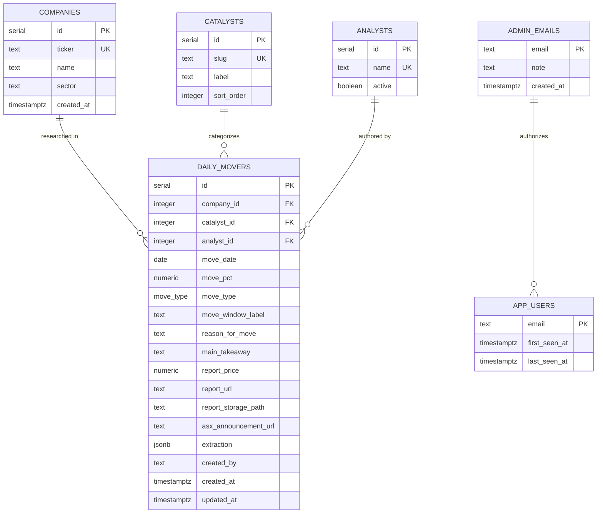
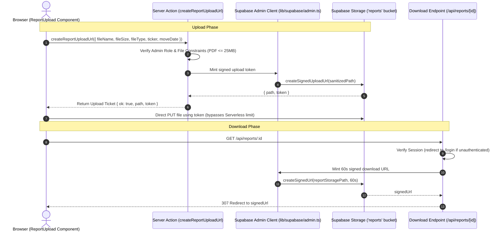
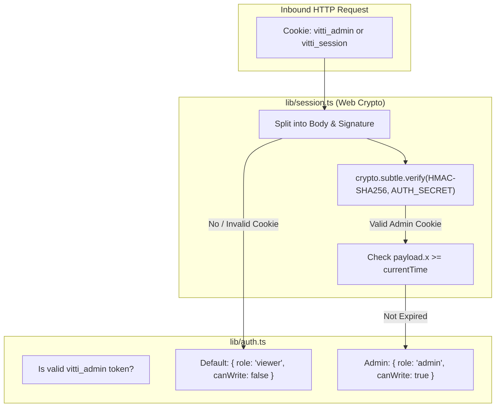
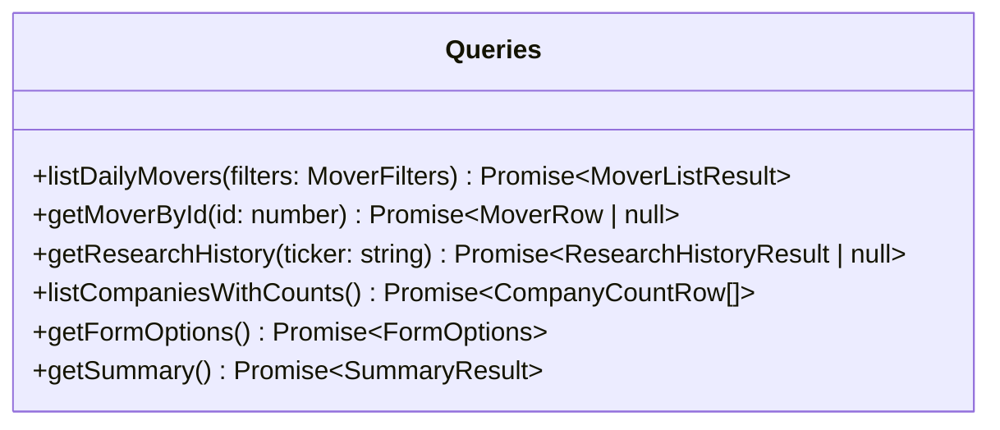
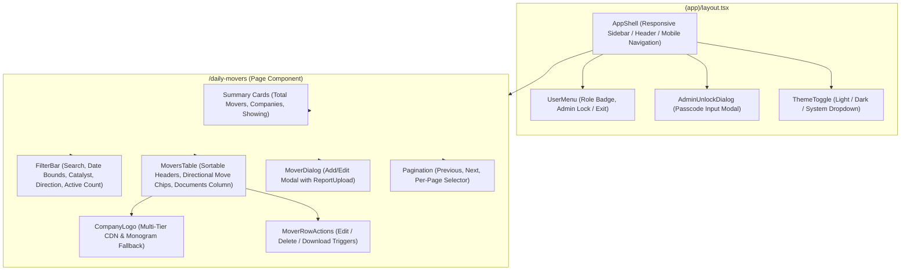

# Low-Level Design (LLD) — Daily Movers Dashboard

## 1. Introduction

This Low-Level Design (LLD) document provides a comprehensive technical specification of the internal code structures, data schemas, API contracts, execution flows, and state management mechanisms implemented in the **Daily Movers Dashboard**.

---

## 2. Directory & Module Structure

```
daily-movers-dashboard/
├── drizzle/                     # Database migrations & SQL setup scripts
│   ├── 0000_big_enchantress.sql
│   ├── 0001_military_senator_kelly.sql
│   └── auth-setup.sql           # RLS, app_users table, admin_emails seed
├── scripts/                     # Operational automation scripts
│   ├── apply-sql.mts            # Idempotent statement-by-statement SQL runner
│   └── storage-setup.mts        # Private Supabase Storage bucket initialization
├── src/
│   ├── actions/                 # Next.js Server Actions (Mutations)
│   │   ├── extract.ts           # extractReportAction (Claude PDF AI extraction)
│   │   ├── movers.ts            # saveMover, deleteMover
│   │   └── reports.ts           # createReportUploadUrl (signed upload tickets)
│   ├── app/                     # Next.js App Router routes & pages
│   │   ├── (app)/               # Protected application layout group
│   │   │   ├── companies/       # Company directory & research history
│   │   │   │   ├── [ticker]/    # Single company research timeline
│   │   │   │   └── page.tsx
│   │   │   ├── daily-movers/    # Main Daily Movers table & filters
│   │   │   │   └── page.tsx
│   │   │   └── layout.tsx       # Auth protection barrier & shell wrapper
│   │   ├── api/                 # API route handlers
│   │   │   └── reports/[id]/    # Protected 60-second signed PDF redirect handler
│   │   │       └── route.ts
│   │   ├── auth/signout/        # POST sign-out route handler
│   │   │   └── route.ts
│   │   ├── login/               # Passwordless identification UI & actions
│   │   │   ├── actions.ts       # signIn Server Action
│   │   │   ├── login-form.tsx   # Client-side form with useActionState
│   │   │   └── page.tsx
│   │   ├── globals.css          # Tailwind CSS 4 theme, typography & OKLCH color tokens
│   │   ├── layout.tsx           # Root HTML layout with ThemeProvider and fonts
│   │   └── page.tsx             # Root redirect to /daily-movers
│   ├── components/              # UI Component Library
│   │   ├── daily-movers/        # Domain-specific components
│   │   │   ├── company-combobox.tsx
│   │   │   ├── filter-bar.tsx
│   │   │   ├── mover-dialog.tsx # Add/Edit modal with Claude AI Auto-Fill dropzone
│   │   │   ├── mover-row-actions.tsx
│   │   │   ├── movers-table.tsx # Table with directional chips & Documents column
│   │   │   ├── pagination.tsx
│   │   │   └── report-upload.tsx# Direct browser-to-storage PDF uploader
│   │   ├── ui/                  # shadcn/ui Base UI & Radix primitives
│   │   ├── app-shell.tsx        # Navigation sidebar, branding & mobile header
│   │   ├── db-not-configured.tsx# Fallback diagnostic alerts
│   │   ├── nav-link.tsx         # Active-state navigation anchor with icons
│   │   ├── theme-provider.tsx   # next-themes client wrapper
│   │   ├── theme-toggle.tsx     # Light / Dark / System theme switcher
│   │   └── user-menu.tsx        # User profile, role badge & sign-out trigger
│   ├── db/                      # Database connection & schema definitions
│   │   ├── index.ts             # Connection caching & pooler configuration
│   │   ├── schema.ts            # Drizzle ORM table & relation schemas
│   │   └── seed.ts              # Idempotent database seed script
│   ├── lib/                     # Utilities, helpers & business logic
│   │   ├── ai/                  # AI & LLM extraction modules
│   │   │   └── anthropic.ts     # Claude 3.5 Sonnet document tool extraction client
│   │   ├── auth-config.ts       # Domain & path matching (edge safe)
│   │   ├── auth.ts              # RBAC & session verification (server-only)
│   │   ├── db-error.ts          # Postgres error code parser & credential scrubbing
│   │   ├── format.ts            # Date, percentage & price formatters
│   │   ├── movers.ts            # Shared runtime types, reportState helpers & pagination constants
│   │   ├── queries.ts           # Drizzle SQL query builder (server-only)
│   │   ├── session.ts           # Web Crypto HMAC-SHA256 token manager
│   │   ├── storage.ts           # Storage path sanitization, upload helper & limits
│   │   ├── supabase/admin.ts    # Service-role Supabase admin client
│   │   ├── use-query-params.ts  # Client hook for URL searchParams synchronization
│   │   ├── utils.ts             # clsx & tailwind-merge helper
│   │   └── validation.ts        # Zod validation schema & form parsers
│   └── middleware.ts            # Edge request interception & session gating
```

---

## 3. Database Schema & Data Models

### 3.1 Entity Relationship Diagram (ERD)



### 3.2 Detailed Table Specifications

#### 1. `companies`
| Column | Type | Constraints | Description |
| :--- | :--- | :--- | :--- |
| `id` | `serial` | Primary Key | Unique internal company ID. |
| `ticker` | `text` | NOT NULL, Unique Index | Primary ticker code (e.g., `JBH`, `SPZ`). |
| `name` | `text` | NOT NULL, B-Tree Index | Full legal/trading name. |
| `sector` | `text` | Nullable | GICS industry sector. |
| `created_at` | `timestamptz` | NOT NULL, Default `now()` | Record creation timestamp. |

#### 2. `catalysts`
| Column | Type | Constraints | Description |
| :--- | :--- | :--- | :--- |
| `id` | `serial` | Primary Key | Unique catalyst ID. |
| `slug` | `text` | NOT NULL, Unique Index | Machine-readable identifier (e.g., `earnings_result`). |
| `label` | `text` | NOT NULL | Human-readable label (e.g., `Earnings Result`). |
| `sort_order` | `integer` | NOT NULL, Default `0` | UI dropdown presentation sort order. |

#### 3. `analysts`
| Column | Type | Constraints | Description |
| :--- | :--- | :--- | :--- |
| `id` | `serial` | Primary Key | Unique analyst ID. |
| `name` | `text` | NOT NULL, Unique Index | Full name of the research analyst. |
| `active` | `boolean` | NOT NULL, Default `true` | Status flag for active research assignment. |

#### 4. `daily_movers`
| Column | Type | Constraints | Description |
| :--- | :--- | :--- | :--- |
| `id` | `serial` | Primary Key | Unique daily mover record ID. |
| `company_id` | `integer` | NOT NULL, FK -> `companies(id)` (`ON DELETE RESTRICT`) | Associated company. |
| `catalyst_id` | `integer` | NOT NULL, FK -> `catalysts(id)` (`ON DELETE RESTRICT`) | Categorized catalyst. |
| `analyst_id` | `integer` | Nullable, FK -> `analysts(id)` (`ON DELETE SET NULL`) | Authoring research analyst. |
| `move_date` | `date` | NOT NULL | Calendar date of report and price move (`YYYY-MM-DD`). |
| `move_pct` | `numeric(6,2)` | NOT NULL | Signed price change percentage (e.g. `-11.50`, `+20.60`). |
| `move_type` | `move_type` enum | NOT NULL (`intraday` \| `closing`) | Pricing timeframe type. |
| `move_window_label`| `text` | Nullable | Verbatim phrasing from PDF (e.g., "Morning Trade"). |
| `reason_for_move` | `text` | NOT NULL (Max 1000 chars) | Detailed catalyst analysis. |
| `main_takeaway` | `text` | NOT NULL (Max 1000 chars) | Core investment conclusion for future reference. |
| `report_price` | `numeric(12,4)` | Nullable | Share price recorded at time of report publication. |
| `report_url` | `text` | Nullable | External link to research PDF/document. |
| `report_storage_path`| `text` | Nullable | Relative object key in private `reports` bucket. |
| `asx_announcement_url`| `text` | Nullable | External link to company ASX announcement. |
| `extraction` | `jsonb` | Nullable | Verbatim raw LLM/OCR structured JSON output. |
| `created_by` | `text` | Nullable | Email address of the creator. |
| `created_at` | `timestamptz` | NOT NULL, Default `now()` | Record creation timestamp. |
| `updated_at` | `timestamptz` | NOT NULL, Default `now()` | Last modification timestamp. |

---

## 4. Report PDF Storage & Delivery Architecture



### 4.1 Storage Path Sanitization (`src/lib/storage.ts`)
- Storage key format: `reports/<ticker>/<moveDate>-<slug>-<random>.pdf`
- Path sanitization converts directory traversal markers (`..`) and non-alphanumeric characters into safe dashes to prevent escape attacks.
- File size limit: `MAX_REPORT_BYTES = 25 * 1024 * 1024` (25 MB).

### 4.2 Protected PDF Route (`/api/reports/[id]/route.ts`)
- Intercepts requests for report documents.
- Verifies session token via `getSessionUser()`. If unauthenticated, redirects to `/login?error=expired`.
- If `reportStoragePath` exists, mints a 60-second signed download URL via `createSupabaseAdminClient()`.
- Falls back to `reportUrl` if only an external link is present.

---

## 5. Authentication, Session & Access Control Layer



### 5.1 Public Viewer Access & Admin Token Format (`src/lib/session.ts`)
- **Default Public Session**: Visitors without an admin token automatically receive a guest session: `{ email: "viewer@vitti.capital", role: "viewer", canWrite: false }`.
- **Admin Token (`vitti_admin`)**: Generated upon passcode verification via `unlockAdmin()`.
- **Structure**: `<base64url(payload)>.<base64url(signature)>`
- **Payload Schema**:
  ```typescript
  type SessionPayload = {
    e: string; // Identifier: "admin@vitti.capital"
    x: number; // Expiration epoch in seconds (TTL: 30 days)
  };
  ```
- **Signing Algorithm**: HMAC using SHA-256 (`crypto.subtle`) with `AUTH_SECRET` (minimum 32-character requirement).
- **Constant-Time Passcode Check**: `verifyAdminPasscode()` uses `timingSafeEqual()` bitwise loop to validate against `ADMIN_PASSCODE`.
- **Cookie Security Attributes**: `HttpOnly = true`, `SameSite = Lax`, `Secure = true` (in production), `Path = /`, `Max-Age = 2,592,000` (30 days).

---

## 6. Data Access Layer (`src/lib/queries.ts`)

All database queries are marked `server-only` to guarantee zero PostgreSQL driver leakage into client bundles.



### 6.1 Query Specifications

#### `listDailyMovers(filters: MoverFilters)`
- **Purpose**: Retrieves paginated, sorted, and filtered research rows for the main table.
- **Joins**: `daily_movers` $\bowtie$ `companies` $\bowtie$ `catalysts` $\leftouterjoin$ `analysts`.
- **Selection**: Returns full row metadata including `reportStoragePath`, `reportUrl`, and `asxAnnouncementUrl`.
- **Filter Clauses (`buildWhere`)**:
  - `q`: Matches `ilike(companies.name, %q%)` $\lor$ `ilike(companies.ticker, %q%)` $\lor$ `ilike(catalysts.label, %q%)`.
  - `from` / `to`: Date bounds against `daily_movers.move_date`.
  - `catalystId`: Direct match on `daily_movers.catalyst_id`.
  - `direction`: Evaluates `daily_movers.move_pct >= 0` (for `up`) or `< 0` (for `down`).

---

## 7. Server Actions & Mutation Lifecycle

### 7.1 `saveMover(_prev: MoverFormState, formData: FormData)`
1. **Authorization Gate**: Executes `assertCanWrite()` $\rightarrow$ `requireAdmin()`.
2. **Schema Validation**: Calls `parseMoverForm(formData)` validating `reportStoragePath`, `reportUrl`, and `asxAnnouncementUrl`.
3. **Execution**: Performs `UPDATE` (if ID present) or `INSERT`.
4. **Cache Invalidation**: Triggers cache revalidation across `/daily-movers`, `/companies`, and `/companies/[ticker]`.

### 7.2 `createReportUploadUrl(input)`
1. Verifies admin permissions via `requireAdmin()`.
2. Validates PDF mime type and file size ($\le 25$ MB).
3. Builds sanitized path via `buildReportPath()`.
4. Mints signed upload token via Supabase Storage admin client.

### 7.3 `POST /api/extract` Route Handler (`src/app/api/extract/route.ts`)
1. Authenticates session caller with `requireAdmin()` (enforces admin privilege).
2. Validates uploaded PDF file bytes ($\le 25$ MB).
3. Invokes `extractMoverFromPdfBuffer()` using Anthropic Claude 3.5 Sonnet with tool calling (`save_daily_mover_research`).
4. **Auto-Entities Resolution**:
   - Queries `companies` by ticker; if not found, automatically inserts the company into `companies` and returns the newly minted entity ID.
   - Maps extracted catalyst slug with multi-strategy fuzzy matching against `catalysts` table to resolve `catalystId`.
   - Maps or auto-creates authoring analyst in `analysts` table to resolve `analystId`.
5. Returns typed JSON `ExtractionResponse` to immediately populate client state in `MoverDialog`.

### 7.4 `unlockAdmin(_prev, formData: FormData)`
1. Extracts `passcode` from submission.
2. Validates against `process.env.ADMIN_PASSCODE` in constant time via `verifyAdminPasscode()`.
3. Issues HMAC-SHA256 signed `vitti_admin` session token cookie and triggers cache revalidation.

### 7.5 `lockAdmin()`
1. Clears `vitti_admin` and `vitti_session` cookies.
2. Revalidates dashboard cache, instantly returning user to View-Only mode.

---

## 8. Frontend Component Architecture, Theming & State Management



### 8.1 Component Specifications

| Component | Type | Responsibility |
| :--- | :--- | :--- |
| `ThemeProvider` | Client | Wraps application with `next-themes` provider supporting `attribute="class"`, `defaultTheme="dark"`, `enableSystem`. |
| `ThemeToggle` | Client | Interactive mode selector (Light / Midnight Dark / System) using `useSyncExternalStore` for hydration-safe rendering. |
| `AppShell` | Server | Renders institutional navigation sidebar, branding with live pulse indicator, mobile header, and main container. |
| `UserMenu` | Client | Renders user avatar circle, role status pill (Admin vs Viewer), and admin lock/exit trigger. |
| `AdminUnlockDialog` | Client | Modal dialog allowing authorized editors to unlock write permissions with the secret admin passcode. |
| `CompanyLogo` | Client | Multi-source company logo renderer combining instant monogram base layer, domain inference, and Google/Clearbit/TradingView CDNs. |
| `FilterBar` | Client | Binds search inputs, date pickers, catalyst dropdowns, and direction selectors to URL query parameters with active filter counts and reset. |
| `MoversTable` | Client | Renders tabular daily mover records with company logos, directional move chips, monospace ticker badges, and **Documents column**. |
| `ReportUpload` | Client | Direct browser-to-storage PDF upload component with drag & drop, file progress, and client validation. |
| `MoverDialog` | Client | Modal dialog handling research record creation and editing, integrating Claude AI Auto-Fill and `ReportUpload`. |
| `CompanyCombobox` | Client | Accessible searchable combobox with company logos for selecting companies by ticker and company name. |
| `MoverRowActions` | Client | Contextual dropdown menu for editing, deleting, and downloading research records. |
| `Pagination` | Client | Controls current page offset, page size selector (10, 25, 50, 100), and result count display. |

### 8.2 Design System, Typography & Color Tokens

- **Primary Font (`--font-sans`)**: **Plus Jakarta Sans** (weights 300 to 800) for clean geometric hierarchy.
- **Monospace Font (`--font-mono`)**: **JetBrains Mono** (weights 400 to 700) for stock tickers, dates, and percentage figures.
- **Dark Theme (Midnight Navy)**:
  - Background: `oklch(0.13 0.032 255)` (`#090e18`)
  - Card Surface: `oklch(0.17 0.035 255)` (`#101726`)
  - Luminous Border: `oklch(0.30 0.035 255 / 55%)`
  - Gains: `bg-emerald-500/10 text-emerald-400 border-emerald-500/25`
  - Declines: `bg-rose-500/10 text-rose-400 border-rose-500/25`
- **Light Theme (Crisp Institutional Slate)**:
  - Background: `oklch(0.985 0.008 245)` (`#f8fafc`)
  - Card Surface: `oklch(1 0 0)` (`#ffffff`)
  - Foreground: `oklch(0.145 0.035 260)` (`#0f172a`)

---

## 9. Error Handling & Diagnostics

### 9.1 Database Error Categorization (`src/lib/db-error.ts`)
Maps PostgreSQL driver error codes to actionable diagnostic messages (`28P01`, `ENOTFOUND`, `ETIMEDOUT`, `ECONNREFUSED`, `3D000`, `42P01`).

### 9.2 Credential Redaction Pattern
```typescript
export function redactCredentials(text: string): string {
  return text
    .replace(/(\b[a-z+]*:\/\/[^\s:/@]+:)[^\s@]*(@)/gi, "$1***$2")
    .replace(/postgres(ql)?:\/\/\S+/gi, "postgres://***");
}
```
Ensures that no database passwords or connection secrets ever surface in client UI alerts, browser consoles, or Vercel serverless runtime logs.
