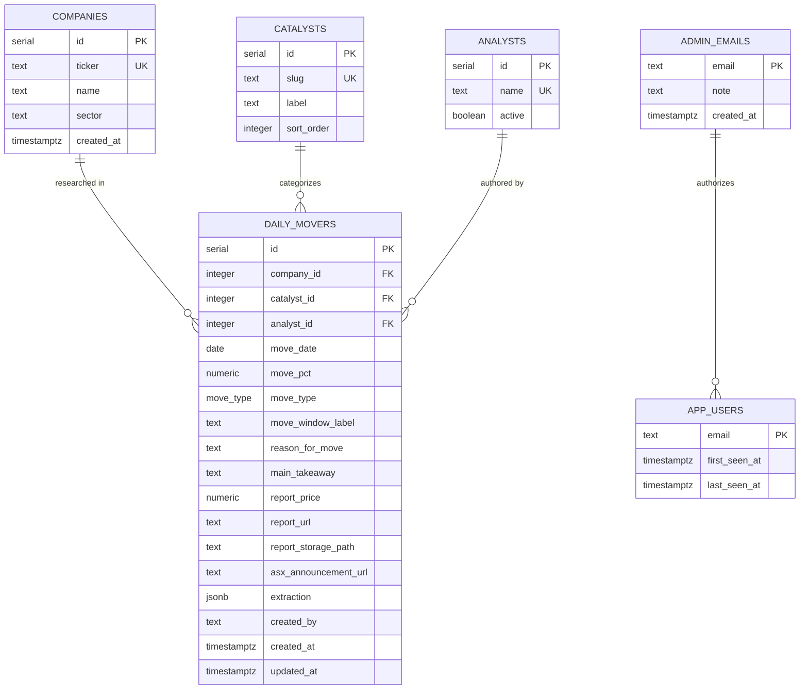
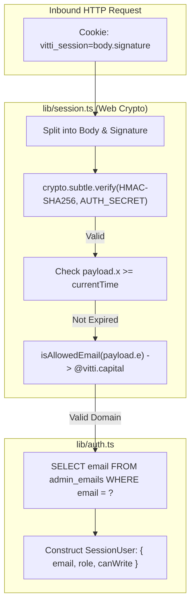
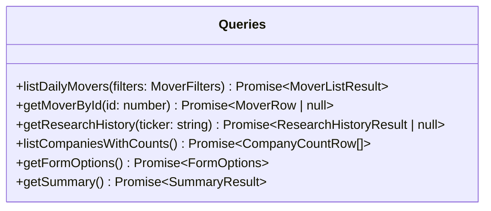
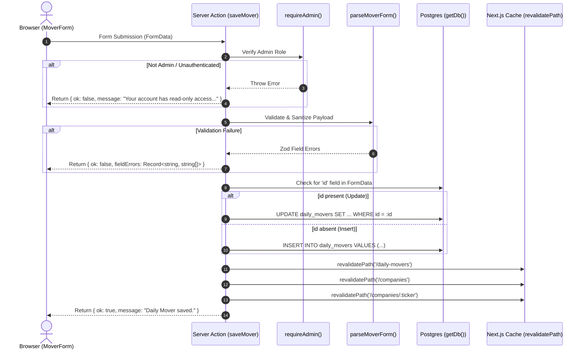
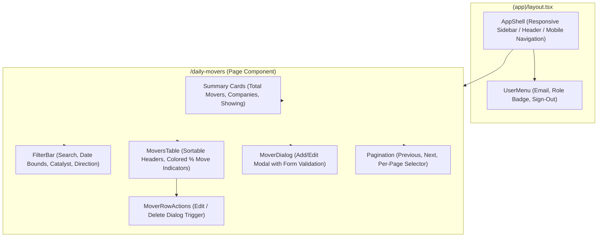

# Low-Level Design (LLD) — Daily Movers Dashboard

## 1. Introduction

This Low-Level Design (LLD) document provides a comprehensive technical specification of the internal code structures, data schemas, API contracts, execution flows, and state management mechanisms implemented in the **Daily Movers Dashboard**.

---

## 2. Directory & Module Structure

```
daily-movers-dashboard/
├── drizzle/                     # Database migrations & SQL setup scripts
│   ├── 0000_big_enchantress.sql
│   ├── 0001_military_senator_kelly.sql
│   └── auth-setup.sql           # RLS, app_users table, admin_emails seed
├── scripts/                     # Operational automation scripts
│   └── apply-sql.mts            # Idempotent statement-by-statement SQL runner
├── src/
│   ├── actions/                 # Next.js Server Actions (Mutations)
│   │   └── movers.ts            # saveMover, deleteMover
│   ├── app/                     # Next.js App Router routes & pages
│   │   ├── (app)/               # Protected application layout group
│   │   │   ├── companies/       # Company directory & research history
│   │   │   │   ├── [ticker]/    # Single company research timeline
│   │   │   │   └── page.tsx
│   │   │   ├── daily-movers/    # Main Daily Movers table & filters
│   │   │   │   └── page.tsx
│   │   │   └── layout.tsx       # Auth protection barrier & shell wrapper
│   │   ├── auth/signout/        # POST sign-out route handler
│   │   │   └── route.ts
│   │   ├── login/               # Passwordless identification UI & actions
│   │   │   ├── actions.ts       # signIn Server Action
│   │   │   ├── login-form.tsx   # Client-side form with useActionState
│   │   │   └── page.tsx
│   │   ├── globals.css          # Tailwind CSS 4 theme & custom utilities
│   │   ├── layout.tsx           # Root HTML layout with Sonner toast provider
│   │   └── page.tsx             # Root redirect to /daily-movers
│   ├── components/              # UI Component Library
│   │   ├── daily-movers/        # Domain-specific components
│   │   │   ├── company-combobox.tsx
│   │   │   ├── filter-bar.tsx
│   │   │   ├── mover-dialog.tsx
│   │   │   ├── mover-row-actions.tsx
│   │   │   ├── movers-table.tsx
│   │   │   └── pagination.tsx
│   │   ├── ui/                  # shadcn/ui Base UI & Radix primitives
│   │   ├── app-shell.tsx        # Navigation sidebar & responsive header
│   │   ├── db-not-configured.tsx# Fallback diagnostic alerts
│   │   ├── nav-link.tsx         # Active-state navigation anchor
│   │   └── user-menu.tsx        # User profile, role badge & sign-out trigger
│   ├── db/                      # Database connection & schema definitions
│   │   ├── index.ts             # Connection caching & pooler configuration
│   │   ├── schema.ts            # Drizzle ORM table & relation schemas
│   │   └── seed.ts              # Idempotent database seed script
│   ├── lib/                     # Utilities, helpers & business logic
│   │   ├── auth-config.ts       # Domain & path matching (edge safe)
│   │   ├── auth.ts              # RBAC & session verification (server-only)
│   │   ├── db-error.ts          # Postgres error code parser & credential scrubbing
│   │   ├── format.ts            # Date, percentage & price formatters
│   │   ├── movers.ts            # Shared runtime types & pagination constants
│   │   ├── queries.ts           # Drizzle SQL query builder (server-only)
│   │   ├── session.ts           # Web Crypto HMAC-SHA256 token manager
│   │   ├── use-query-params.ts  # Client hook for URL searchParams synchronization
│   │   ├── utils.ts             # clsx & tailwind-merge helper
│   │   └── validation.ts        # Zod validation schema & form parsers
│   └── middleware.ts            # Edge request interception & session gating
```

---

## 3. Database Schema & Data Models

### 3.1 Entity Relationship Diagram (ERD)



### 3.2 Detailed Table Specifications

#### 1. `companies`
| Column | Type | Constraints | Description |
| :--- | :--- | :--- | :--- |
| `id` | `serial` | Primary Key | Unique internal company ID. |
| `ticker` | `text` | NOT NULL, Unique Index | Primary ticker code (e.g., `JBH`, `SPZ`). |
| `name` | `text` | NOT NULL, B-Tree Index | Full legal/trading name. |
| `sector` | `text` | Nullable | GICS industry sector. |
| `created_at` | `timestamptz` | NOT NULL, Default `now()` | Record creation timestamp. |

#### 2. `catalysts`
| Column | Type | Constraints | Description |
| :--- | :--- | :--- | :--- |
| `id` | `serial` | Primary Key | Unique catalyst ID. |
| `slug` | `text` | NOT NULL, Unique Index | Machine-readable identifier (e.g., `earnings_result`). |
| `label` | `text` | NOT NULL | Human-readable label (e.g., `Earnings Result`). |
| `sort_order` | `integer` | NOT NULL, Default `0` | UI dropdown presentation sort order. |

#### 3. `analysts`
| Column | Type | Constraints | Description |
| :--- | :--- | :--- | :--- |
| `id` | `serial` | Primary Key | Unique analyst ID. |
| `name` | `text` | NOT NULL, Unique Index | Full name of the research analyst. |
| `active` | `boolean` | NOT NULL, Default `true` | Status flag for active research assignment. |

#### 4. `daily_movers`
| Column | Type | Constraints | Description |
| :--- | :--- | :--- | :--- |
| `id` | `serial` | Primary Key | Unique daily mover record ID. |
| `company_id` | `integer` | NOT NULL, FK -> `companies(id)` (`ON DELETE RESTRICT`) | Associated company. |
| `catalyst_id` | `integer` | NOT NULL, FK -> `catalysts(id)` (`ON DELETE RESTRICT`) | Categorized catalyst. |
| `analyst_id` | `integer` | Nullable, FK -> `analysts(id)` (`ON DELETE SET NULL`) | Authoring research analyst. |
| `move_date` | `date` | NOT NULL | Calendar date of report and price move (`YYYY-MM-DD`). |
| `move_pct` | `numeric(6,2)` | NOT NULL | Signed price change percentage (e.g. `-11.50`, `+20.60`). |
| `move_type` | `move_type` enum | NOT NULL (`intraday` \| `closing`) | Pricing timeframe type. |
| `move_window_label`| `text` | Nullable | Verbatim phrasing from PDF (e.g., "Morning Trade"). |
| `reason_for_move` | `text` | NOT NULL (Max 1000 chars) | Detailed catalyst analysis. |
| `main_takeaway` | `text` | NOT NULL (Max 1000 chars) | Core investment conclusion for future reference. |
| `report_price` | `numeric(12,4)` | Nullable | Share price recorded at time of report publication. |
| `report_url` | `text` | Nullable | External link to research PDF/document. |
| `report_storage_path`| `text` | Nullable | Bucket path for uploaded PDF asset. |
| `asx_announcement_url`| `text` | Nullable | External link to company ASX announcement. |
| `extraction` | `jsonb` | Nullable | Verbatim raw LLM/OCR structured JSON output. |
| `created_by` | `text` | Nullable | Email address of the creator. |
| `created_at` | `timestamptz` | NOT NULL, Default `now()` | Record creation timestamp. |
| `updated_at` | `timestamptz` | NOT NULL, Default `now()` | Last modification timestamp. |

**Indexes on `daily_movers`**:
- `daily_movers_company_date_idx`: `(company_id, move_date DESC)` — Accelerates company research history queries.
- `daily_movers_date_idx`: `(move_date DESC)` — Accelerates default chronological dashboard listings.
- `daily_movers_catalyst_idx`: `(catalyst_id)` — Accelerates catalyst filtering queries.

#### 5. `admin_emails`
| Column | Type | Constraints | Description |
| :--- | :--- | :--- | :--- |
| `email` | `text` | Primary Key | Work email address granted admin write privileges. |
| `note` | `text` | Nullable | Description of role or reason for access. |
| `created_at` | `timestamptz` | NOT NULL, Default `now()` | Access grant timestamp. |

#### 6. `app_users`
| Column | Type | Constraints | Description |
| :--- | :--- | :--- | :--- |
| `email` | `text` | Primary Key | Work email address that has authenticated. |
| `first_seen_at` | `timestamptz` | NOT NULL, Default `now()` | Initial sign-in timestamp. |
| `last_seen_at` | `timestamptz` | NOT NULL, Default `now()` | Most recent sign-in timestamp. |

---

## 4. Authentication, Session & Access Control Layer



### 4.1 Session Token Format (`src/lib/session.ts`)
- **Structure**: `<base64url(payload)>.<base64url(signature)>`
- **Payload Schema**:
  ```typescript
  type SessionPayload = {
    e: string; // User email address (lowercased)
    x: number; // Expiration epoch in seconds (TTL: 30 days)
  };
  ```
- **Signing Algorithm**: HMAC using SHA-256 (`crypto.subtle`) with `AUTH_SECRET` (minimum 32-character requirement).
- **Constant-Time Verification**: `timingSafeEqual()` bitwise loop prevents timing attacks during signature verification.
- **Cookie Security Attributes**: `HttpOnly = true`, `SameSite = Lax`, `Secure = true` (in production), `Path = /`, `Max-Age = 2,592,000` (30 days).

### 4.2 Middleware Pipeline (`src/middleware.ts`)
- Intercepts all paths excluding Next.js static bundles and media files.
- Reads `vitti_session` cookie via `readSessionToken()`.
- Validates domain suffix against `ALLOWED_EMAIL_DOMAIN` (`vitti.capital`).
- Enforces redirection rules:
  - If unauthenticated and accessing a non-public route $\rightarrow$ 302 Redirect to `/login?next=<sanitized_path>`.
  - If authenticated and accessing `/login` $\rightarrow$ 302 Redirect to `/daily-movers`.
  - If cookie domain is no longer permitted $\rightarrow$ Clears cookie and redirects to `/login?error=domain`.

### 4.3 Role-Based Authorization Model (`src/lib/auth.ts`)
```typescript
export type SessionUser = {
  email: string;
  role: "admin" | "viewer";
  canWrite: boolean; // role === 'admin'
};
```
- **Dynamic Role Resolution**: Role is queried dynamically from `admin_emails` on every request. No role metadata is stored inside the session cookie or `app_users`.
- **Fail-Closed Strategy**: If a database error occurs during role resolution, `roleFor()` catches the error and safely falls back to `viewer`.
- **Enforcement Helpers**:
  - `requireSessionUser()`: Asserts that an active session exists; throws `NotAuthenticatedError`.
  - `requireAdmin()`: Asserts that `user.canWrite === true`; throws `NotAuthorisedError`.

---

## 5. Data Access Layer (`src/lib/queries.ts`)

All database queries are marked `server-only` to guarantee zero PostgreSQL driver leakage into client bundles.



### 5.1 Query Specifications

#### `listDailyMovers(filters: MoverFilters)`
- **Purpose**: Retrieves paginated, sorted, and filtered research rows for the main table.
- **Joins**: `daily_movers` $\bowtie$ `companies` $\bowtie$ `catalysts` $\leftouterjoin$ `analysts`.
- **Filter Clauses (`buildWhere`)**:
  - `q`: Matches `ilike(companies.name, %q%)` $\lor$ `ilike(companies.ticker, %q%)` $\lor$ `ilike(catalysts.label, %q%)`.
  - `from` / `to`: Date bounds against `daily_movers.move_date`.
  - `catalystId`: Direct match on `daily_movers.catalyst_id`.
  - `direction`: Evaluates `daily_movers.move_pct >= 0` (for `up`) or `< 0` (for `down`).
- **Sorting (`buildOrderBy`)**:
  - `date`: `daily_movers.move_date [ASC|DESC], daily_movers.id DESC` (tie-breaker).
  - `move`: `daily_movers.move_pct [ASC|DESC], daily_movers.id DESC`.
  - `ticker`: `companies.ticker [ASC|DESC], daily_movers.move_date DESC`.
  - `company`: `companies.name [ASC|DESC], daily_movers.move_date DESC`.
- **Return Type**: `{ rows: MoverRow[], total: number, page: number, perPage: number, pageCount: number }`.

#### `getResearchHistory(ticker: string)`
- **Purpose**: Retrieves all historical research for a given ASX ticker.
- **Operation**: Resolves company record by `ilike(companies.ticker, ticker)`, then executes a single indexed join query filtered by `company_id`, sorted by `move_date DESC, id DESC`.

#### `listCompaniesWithCounts()`
- **Purpose**: Populates the company directory page.
- **Operation**: Performs `companies` $\leftouterjoin$ `daily_movers` with `COUNT(daily_movers.id)` and `MAX(daily_movers.move_date)`, grouped by company columns, ordered by `companies.ticker ASC`.

#### `getFormOptions()`
- **Purpose**: Provides lookup values for Add/Edit dialogs.
- **Operation**: Executes `Promise.all` over `companies` (sorted by ticker), `catalysts` (sorted by `sortOrder`), and `analysts` (where `active = true`).

---

## 6. Server Actions & Mutation Lifecycle



### 6.1 `saveMover(_prev: MoverFormState, formData: FormData)`
1. **Authorization Gate**: Executes `assertCanWrite()` $\rightarrow$ `requireAdmin()`. Catches `NotAuthenticatedError` and `NotAuthorisedError` to return user-friendly messages.
2. **Schema Validation**: Calls `parseMoverForm(formData)`. If validation fails, returns field-level error mapping to the form.
3. **Branching Logic**:
   - **Update (`id` exists)**: Validates positive integer ID, updates `daily_movers`, updates `updatedAt = new Date()`.
   - **Insert (`id` absent)**: Inserts record with `createdBy = actor.email`.
4. **Cache Invalidation**: Triggers cache revalidation across `/daily-movers`, `/companies`, and `/companies/[ticker]`.

### 6.2 `deleteMover(_prev: MoverFormState, formData: FormData)`
1. Verifies admin permissions via `assertCanWrite()`.
2. Validates target integer record ID.
3. Executes `DELETE FROM daily_movers WHERE id = :id RETURNING company_id`.
4. Triggers revalidation for the associated company ticker route and main tables.

### 6.3 `signIn(_prev: LoginState, formData: FormData)`
1. Validates presence of email input.
2. Validates `@vitti.capital` email domain via `isAllowedEmail()`.
3. Creates HMAC session token via `createSessionToken(email)`.
4. Writes `vitti_session` cookie to HTTP response headers.
5. Invokes non-blocking audit write `touchUser(email)` to update `app_users`.
6. Returns validated redirect path computed via `safeNextPath()`.

---

## 7. Input Validation & Form Serialization (`src/lib/validation.ts`)

```typescript
export const moverInputSchema = z.object({
  companyId: z.coerce.number().int().positive("Select a company"),
  catalystId: z.coerce.number().int().positive("Select a catalyst"),
  analystId: z.union([z.coerce.number().int().positive(), z.null()]),
  moveDate: z.string().regex(/^\d{4}-\d{2}-\d{2}$/, "Enter a valid date"),
  movePct: z.coerce
    .number()
    .min(-100, "A fall cannot exceed 100%")
    .max(1000, "That looks too large — check the figure")
    .refine((n) => n !== 0, "A 0% move isn't a mover"),
  moveType: z.enum(["intraday", "closing"]),
  moveWindowLabel: z.union([z.string().max(60), z.null()]),
  reasonForMove: z.string().min(1).max(1000),
  mainTakeaway: z.string().min(1).max(1000),
  reportPrice: z.union([z.coerce.number().positive(), z.null()]),
  reportUrl: z.union([z.url(), z.null()]),
  asxAnnouncementUrl: z.union([z.url(), z.null()]),
});
```

### Form Value Coercion Rules:
- Empty strings (`""`) are normalized to `null` for optional strings and URLs.
- Sentinel value `"none"` for Radix Select components is normalized to `null`.
- Missing required numbers remain `undefined` prior to Zod parsing to prevent accidental coercion to `0`.

---

## 8. Frontend Component Architecture & State Management



### 8.1 Component Responsibilities

| Component | Type | Responsibility |
| :--- | :--- | :--- |
| `AppShell` | Server | Renders institutional navigation sidebar, branding, mobile header, and main container. |
| `UserMenu` | Client | Renders user email, read-only indicator badge (if viewer), and sign-out form POST trigger. |
| `FilterBar` | Client | Binds search inputs, date pickers, catalyst dropdowns, and direction selectors to URL query parameters. |
| `MoversTable` | Client | Renders tabular daily mover records with directional color coding (emerald for gains, red for losses) and sortable column headers. |
| `MoverDialog` | Client | Modal dialog handling research record creation and editing via `useActionState(saveMover)`. |
| `CompanyCombobox` | Client | Accessible searchable combobox for selecting companies by ticker and company name. |
| `MoverRowActions` | Client | Contextual dropdown menu for editing and deleting research records (rendered for admins only). |
| `Pagination` | Client | Controls current page offset, page size selector (10, 25, 50, 100), and result count display. |
| `DbNotConfigured` | Client | Diagnostic card displayed when `DATABASE_URL` is missing or the database connection is unreachable. |

### 8.2 URL-Driven State Management (`src/lib/use-query-params.ts`)
- URL search parameters serve as the single source of truth for dashboard state.
- Debounced search execution (300ms) on text input prevents query churn.
- Changing any filter parameter automatically resets `page` to `1` to avoid landing on empty offset ranges.
- React 19 `useTransition` wraps router state updates to maintain UI responsiveness during server-side re-renders.

---

## 9. Error Handling & Diagnostics

### 9.1 Database Error Categorization (`src/lib/db-error.ts`)
Maps PostgreSQL driver error codes to actionable diagnostic messages:
- `28P01`: Password authentication failure.
- `ENOTFOUND`: Host unreachable / DNS failure.
- `ETIMEDOUT` / `CONNECT_TIMEOUT`: Connection timeout.
- `ECONNREFUSED`: Port connection refused.
- `3D000`: Target database does not exist.
- `42P01`: Missing table error (prompts user to run migrations).

### 9.2 Credential Redaction Pattern
```typescript
export function redactCredentials(text: string): string {
  return text
    .replace(/(\b[a-z+]*:\/\/[^\s:/@]+:)[^\s@]*(@)/gi, "$1***$2")
    .replace(/postgres(ql)?:\/\/\S+/gi, "postgres://***");
}
```
Ensures that no database passwords or connection secrets ever surface in client UI alerts, browser consoles, or Vercel serverless runtime logs.
